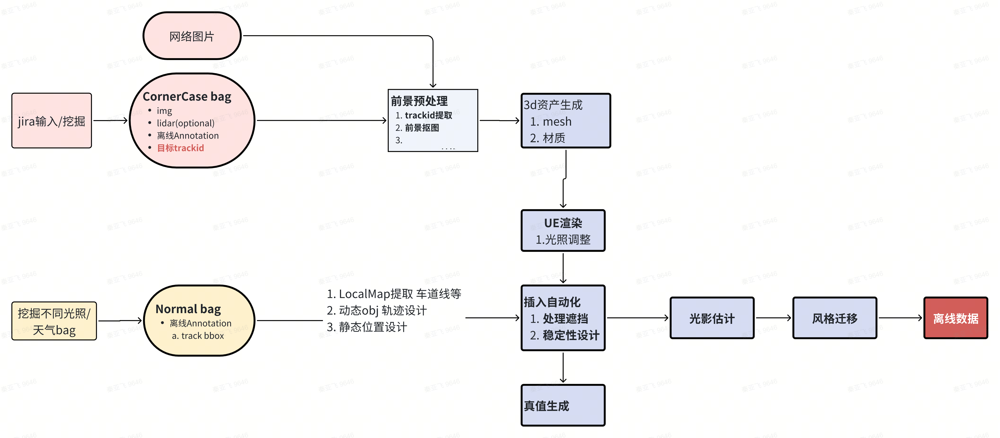

# 4D label

1. 已完成
   1. 4d激光点云重建
   2. 动态OD自动标注，300w帧=5w bag 【2fps，一个bag=300/5=60帧】
   3. 车道线人工标注：？
   4. 静态hdmap预刷+人工标注，60w帧=1w bag
   5. 激光occ：20w帧 = 0.3w个bag
   6. mmt全要素预刷：？
2. 
3. 

## 1.静态label
1. 地图预刷方案
   1. 使用离线地图定位，ddld重定位匹配去掉现势性问题
2. DDLD预刷
   1. 拼接多帧恢复局部地图，曲率优化、拓扑结构优化
3. 模型
   1. HdmapNet，只有几何
   2. maptrv2，矢量化
   3. openlinev2，处理绑定关系。
4. 现阶段：地图去掉几何，保留逻辑，感知搞几何
5. lotus 线上车道线模型演化
   1. LidarLaneATT-> LidarMTL  ~2023Q1 
   2. BevLaneDet ~2024Q1
   3. MapQR ~ 2024Q4 [使用dense query的head] [线上感知模型也证明了sparse query对于车道线的检测效果比dense query要差]
   4. OneModel ~now。共享backbone，车道线mapqr+障碍物sparse4D
6. 

## 2.动态label
1. BEVDET：只有检测
2. MUTR3d：吃掉OD后处理
3. 纯视觉动态bev大模型的真值来自于lidar 作为冷启动
4. CenterPoint https://zhuanlan.zhihu.com/p/524608535

5. 伪标签flow：
  1. **10w张**人工BEV障碍物标注（在点云上标注，图像上也标注障碍物的可见性）训练的模型【centerpoint模型、多帧后处理跟踪，然后转bevdet】
  2. 静态元素，用hdmap标注。没法区分现实变化
6. 人工标注：会生成一个结果，存放在其他文件。【没有基于伪标签做调整，链路上通的，没有流程管理系统】

## 3.标注规范+遮挡/截断问题
1. OD：脑补bbox、遮挡、截断的属性，需要用模型算子赋予。trackid 后处理解决
   1. 截断，用3d bbox投影到2d也可以解决
2. 车道线遮挡没处理，有脑补的需求
3. 静态地面标线标注规范
   1. 被硬隔离（连续高墙/水泥护栏/宽隔离）隔断时不标对向元素，通常视觉和点云看不见最近的线
   2. 被窄护栏隔离，点云可见、视觉模糊可见 时需要标注
   3. m2n车道数量变化，中心线不再标
4. 动态OD标注规范（行车7v、泊车 fisheye 4v+front_wide）
   1. front far和front wide同时出现的目标，改成60米以内调整贴合front-wide视角，60米以外调整贴合front-far视角
   2. 泊车场景，原始框投影到图像上不贴合程度没有超过1/3，不需要调框
   3. 图像上被自车相机外壳(或者自车)挡住的目标赋予截断属性，不用遮挡属性
   4. 精度要求：投影到图像上的3D框的边缘与目标实际边缘的误差≤3pix
5. 动态OD遮挡和截断的赋值：
   ￮行车：
   i.前向100米到250米内：除了camera_front_far，其他相机都赋值为-1；
   ii.100米内：
   非鱼眼相机：需要根据具体情况进行判断；
   鱼眼相机：仅30m以内需要根据具体情况进行判断，超过30m的目标，鱼眼相机无需判断遮挡和截断属性；
   ￮泊车：
   i.30米：需要根据具体情况进行判断；
   ￮点云可见，但所有图像视角都不可见的目标（所有相机视角遮挡和截断均赋值为-1）
   如果图像也无法判定尺寸，则基于联想标注完整的边框，按照 障碍物默认尺寸.xlsx 
6. 泊车occ标注规范：
   1. 点云标注范围：自车前后各50米；
   2. 包括轮档
   3. #TODO 柱子被他车挡住，地面上Voxel是否free？
   4. 遮挡属性：参考occ3d处理
7. 视差问题，激光可见/camera不可见。针对某个OD id
   1. 人工标：所有图像中，有一个cam可见开始标3d bbox；连续3帧不可见，换id。
   2. 自动标？
8. 

## 4.slot

1. 标注规范
   1. 每个角点是否可见
   2. 遮挡、截断
   3. 是否占用+类型
   4. 场景：车位线颜色、入口线类型、地面类型
2. 

## 5.occ

1. occ
   1. 运动信息/occ flow：类似3d版本的光流。输出 Voxel grid的速度聚类，得到Voxl flow
   2. 语义：可以增加，但是只能对常见类别做；不常见类别（如地上轮胎）不好搞。所以occ更多的提供几何信息
2. 论文occ3d处理了遮挡问题，制作了两个数据集【未开源 】
   1. Poisson reconstruction 或者 VDBFusion对**空洞**进行修复
   2. 分别给cam和lidar赋予 observable属性
   3. 优化cam 和lidar对不齐问题，尤其是边界
      1. 已知Image Segmentation标注结果，从相机光心发出射线，以射线遇到第一个与图像标签一致的Voxel为止，中间被占据的Voxel被修正为free
3. occ遮挡问题: 
   1. 局部地图到单帧的label，考虑一个Voxel在墙的后面
   2. 单帧建图不严重，但也有2d/3d不一致问题
   3. 从相机光心经过像素 发出射线（视锥），找到最近相交的3d点/mesh，后面的3d点都过滤掉；也可以加上语义一致判断
4. Bresenham https://zhuanlan.zhihu.com/p/507645801

## 6.纯视觉点云（静态）

1. 目的：应对国外研发车、量产数据没有lidar
2. 支持任务/泊车
   1. BEV车位线/地面标线的人工标注【比lidar反射强度清晰】
   2. occ自动标注，#TODO 对class要求不高？
   3. OD人工标注；自动标注较难

3. 评价方式：倒角距离（Chamfer Distance, CD），两个点集之间的双向最近邻距离之和。
   1. 依赖​​KD树​​或​​最近邻搜索算法​​
   2. 局限：对噪声敏感，离群点可能导致距离值偏大
   3. 实测结果：地面 0.2m，car 0.35m
   
4. 方案一：单帧多视角拼接
   1. 单帧点云重建：depth+segment反投影，depth绝对尺度用colmap约束
   2. 单帧有序点梯度阈值剔除：3d梯度 tensor(3 h w)，是有序的3d点，不用knn搜索；相邻两个点 diff，距离 >0.1m阈值剔除。
   3. 解决相邻cam overlap问题，
      1. 多视角外点剔除：依次以本cam为中心，投影多视角localmap：本cam 点云后面的点（>0.1m）都剔除
      2. 参考occ3d，使用class一致性去掉外点

5. 方案二：多帧多视角拼接
6. 方案三：3dgs重建：带语义/实例分割 Gaussain  --> open3d（解决不带语义的问题）--> mesh/点云 --> OD bbox --> 投影到单帧图像
7. 方案四：泊车场景，地面3dgs重建优化，有了2d地面分割，三种地面点云补全方式对比
    1.  colmap初始点云稀疏，用IPM方式（相机外参反投影）补齐地面点，作为初始点云，再走3dgs重建链路，耗时不变
    2.  泊松重建+NN，质量不高，空洞多
    3.  用depthanything补齐，地面深度不准，尺度不准。

8. 做OD autolabel的问题
   1. mask2former实例分割问题，只能做到语义分割
      1. 只有单图像；多相机、时序，不能保证id的连续【SAM2可以解决时序，多视角一般是BEV模型直接出3d结果了】
      2. 相邻同类实例无法分开
   2. 遮挡时，重建点云不完整，规则无法脑补（bbox生成：open3d有约束的最小包围盒实现）
   3. #TODO 尝试用纯视觉点云 转换成 lidar点云，走伪标签流程

9.  像素点深度定义优化
   1. diff-gaussian-resterization cuda渲染加速优化中像素的深度定义的几何精度不佳(使用3d高斯的位置为投影点)，相比之前的使用2D高斯的定义方式，其深度为经过相机原点的射线与2d高斯球相交的交点为投影点，投影点的深度即为2d高斯在该像素点的深度信息。
   2. 优化：  
     - 法向量采用alpha-blending累加；
     - 对高斯平面深度采用alpha-blending累加；
     - 已知累加的平面法向量和平面深度，计算射线与平面交点，交点坐标z值即为像素的深度值；
10. 数据生产耗时：30s bag/3090单卡，3dgs训练=30min，全链路=2.5h
   

11. 

# 数据合成

1. 规划中（合成数据）
   海外TSI 10w帧
   异型车、异型障碍物 30w帧
   路障：锥桶、水马、栅栏、地锁、限位器等 30w帧
   红绿灯 30w帧
   AEB测试 30w帧
2. 使用合成数据提点的情况
   1. TSI：提升10个点
   2. 异型车：提3个点
   3. 锥桶：提5个点

# 其他
3. Tesla 4D label：depth图的质量不高，是一个问题
4. 跨车型泛化问题：3d感知任务，更容易受外参影响；位置变化问题还是不好解决；pose通过虚拟相机解决
   
5. 数据处理：
   1. 解bag，标定，虚拟相机适配，BEV网格大小适配，
   2. bev4d文件夹格式
   3. baseflow：解bag，点云建图pcd-map，archive上传oss