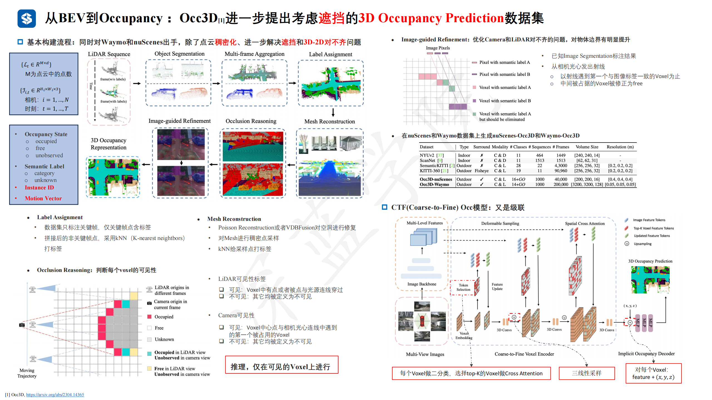
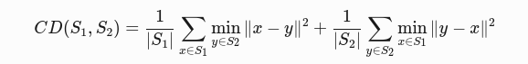
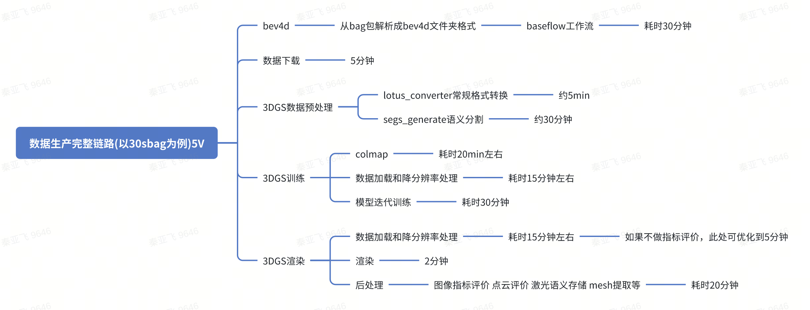
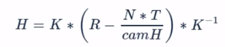

# BEV
1. pointpillar
2. 

## Project 1 Vision Transformer 【DETR】
https://www.shenlanxueyuan.com/course/752/task/30320/show

## LSS转换【DETR3D】
1. 模型可分为3个阶段：https://www.shenlanxueyuan.com/course/752/task/30332/show
   1. 阶段1 Lift：首先提取图像特征，估计每个像素深度分布估计
      阶段2 Splat：将Lift的点特征压缩为BEV特征。PointPillars
      阶段3 Shoot：基于BEV特征，进行路径规划（不在本章节讨论范围）
2. 

## BEV转换【BEVFormer】
https://www.shenlanxueyuan.com/course/752/task/30336/show

# occ

1. occ
   1. 运动信息/occ flow：类似3d版本的光流。输出 Voxel grid的速度聚类，得到Voxl flow
   2. 语义：可以增加，但是只能对常见类别做；不常见类别（如地上轮胎）不好搞。所以occ更多的提供几何信息
2. 论文occ3d处理了遮挡问题，制作了两个数据集【未开源 】
   1. Poisson reconstruction 或者 VDBFusion对**空洞**进行修复
   2. 分别给cam和lidar赋予 observable属性
   3. 优化cam 和lidar对不齐问题，尤其是边界
      1. 已知Image Segmentation标注结果，从相机光心发出射线，以射线遇到第一个与图像标签一致的Voxel为止，中间被占据的Voxel被修正为free
3. occ遮挡问题: 
   1. 局部地图到单帧的label，考虑一个Voxel在墙的后面
   2. 单帧建图不严重，但也有2d/3d不一致问题
   3. 从相机光心经过像素 发出射线（视锥），找到最近相交的3d点/mesh，后面的3d点都过滤掉；也可以加上语义一致判断
4. Bresenham https://zhuanlan.zhihu.com/p/507645801

## occ线上开发

1. 数据集
   1. 4d label人工标注
   2. OD标注数据和Freespace标注数据聚合 -->单帧
   3. 静态点云语义赋予及叠加【处理遮挡问题】
   4. 动态障碍物语义赋予
   5. Voxel真值，分辨率0.2m
2. baseline：FlashOcc
   1. ViewTransform: 原始的算法是针对针孔相机模型开发的，需要修改成鱼眼虚拟相机模型
   2. loss：customFocalLoss
   3. BEV特征图：200*200，高度是实际物理区域：40 *40m。 # TODO occ高度=2m？
3. FreepaceFusion 模块核心的算法模块是占据栅格地图的更新维护, GroundlineFusion后处理：ground line生成
4. 工程化
   1. INT8量化
   2. 稀疏计算
   3. 将训练好的模型权重转化为tensorrt

5. 存在问题
   •动态障碍物处理
   •检出距离过短
   •降低分辨率
   •道路边界平顺性异常
6. 解决后处理cornercase
   1. 问题：在拍平的过程中取了z_idx = 10的位置，这样处理是比较简单且不合理的，因为在障碍物离本车较近的时候，因为视野盲区等问题，在z_idx = 10 的位置没有检出。
   2. 解决：在坐标（x_idx, y_idx）位置，沿着z轴方向，向上索引，只有在z轴方向上存在一个被占用的格子，那（x_idx, y_idx）位置即被占用。
7. #TODO 超声波融合；和od结果是否融合？
8. occ激光数据集问题
   •点云缺失
   •低矮障碍物与地面高度一致，并且点云语义赋予的不完全
   •路面有噪点，不干净
   •动静态物体重合
   •动态障碍物处理有问题
   •具有车语义，但与ego重叠的点云：车速低于0.25
   •类别错误
   •动态障碍物点云没有抠干净
   •路面有噪点
   •地面动态点云未扣干净
   •栏杆卡车里
   •路面语义不全

# slot
1. yolox_nano：直接预测目标中心点及边界框尺寸
2. 车位后处理：选择离自车3米范围内的检测结果取更新车位的宽度，长度，角度以及限位器的位置；在泊入阶段保持不变；
3. dr 补偿航偏角，精度提升；
4. 典型问题
   1. 斜列漏检严重、不稳
   2. 轮档检测位置不准
   3. 水平车位误检漏检，占用属性错误
   4. 水平空车位无法抛库
   5. 检测车宽过长，撞路沿，--> 加入路沿检测  
5. 规划判断slot 可泊入属性

# 4D label

1. 已完成
   1. 4d激光点云重建
   2. 动态OD自动标注，200w帧=40w bag 【0.5fps】
   3. 静态hdmap预刷+人工标注，50w帧=10w bag
   4. occ ：20w帧
   5. 车道线人工标注
   6. mmt全要素预刷
2. 规划中（合成数据）
   海外TSI 10w帧
   异型车、异型障碍物 30w帧
   路障：锥桶、水马、栅栏、地锁、限位器等 30w帧
   红绿灯 30w帧
   AEB测试 30w帧
3. 

## 静态label
1. 地图预刷方案
   1. 使用离线地图定位，ddld匹配去掉现势性问题
2. DDLD预刷
   1. 拼接多帧恢复局部地图，曲率优化、拓扑结构优化
3. 模型
   1. HdmapNet，只有几何
   2. maptrv2，矢量化
   3. openlinev2，处理绑定关系。
4. 现阶段：地图去掉几何，保留逻辑，感知搞几何
5. lotus 线上车道线模型演化
   1. LidarLaneATT-> LidarMTL  ~2023Q1 
   2. BevLaneDet ~2024Q1
   3. MapQR ~ 2024Q4 [使用dense query的head] [线上感知模型也证明了sparse query对于车道线的检测效果比dense query要差]
   4. OneModel ~now。共享backbone，车道线mapqr+障碍物sparse4D
6. 

## 车道线车端问题
1. 固定点位误检、漏检
   地图鲜度问题
   真值处理问题
2. 固定模式漏检，如乡村、景区道路无车道线处漏检；复杂匝道漏检
   缺少对应数据、数据分布不平衡
3. 行车偏左/偏右
   优先检查传感器标定问题
   dataloader中进行适当的外参噪声处理

￮拥挤--城市路口
￮车道线属性（鱼骨线，可变车道）
￮匝道汇入汇出 
￮中心线导流线 
￮雨天 
￮夜晚
￮左虚右实，左实右虚，双实线，双虚线
￮虚实线分界

￮行车偏右 
￮宽车道
￮城区路口  (缺数据) 
▪停止线
▪斑马线
▪跨路口车道线
▪环岛
￮车道线拓扑
￮车道数量变化 
￮车道线颜色

## 动态label
1. BEVDET：只有检测
2. MUTR3d：吃掉OD后处理

## 标注规范+遮挡/截断问题
1. OD：脑补bbox、遮挡、截断的属性，需要用模型算子赋予。trackid 后处理解决
2. 车道线遮挡没处理，有脑补的需求
3. 静态地面标线标注规范
   1. 被硬隔离（连续高墙/水泥护栏/宽隔离）隔断时不标对向元素，通常视觉和点云看不见最近的线
   2. 被窄护栏隔离，点云可见、视觉模糊可见 时需要标注
   3. m2n车道数量变化，中心线不再标
4. 动态OD标注规范（行车7v、泊车 fisheye 4v+front_wide）
   1. front far和front wide同时出现的目标，改成60米以内调整贴合front-wide视角，60米以外调整贴合front-far视角
   2. 泊车场景，原始框投影到图像上不贴合程度没有超过1/3，不需要调框
   3. 图像上被自车相机外壳(或者自车)挡住的目标赋予截断属性，不用遮挡属性
   4. 精度要求：投影到图像上的3D框的边缘与目标实际边缘的误差≤3pix
5. 动态OD遮挡和截断的赋值：
   ￮行车：
   i.前向100米到250米内：除了camera_front_far，其他相机都赋值为-1；
   ii.100米内：
   非鱼眼相机：需要根据具体情况进行判断；
   鱼眼相机：仅30m以内需要根据具体情况进行判断，超过30m的目标，鱼眼相机无需判断遮挡和截断属性；
   ￮泊车：
   i.30米：需要根据具体情况进行判断；
   ￮点云可见，但所有图像视角都不可见的目标（所有相机视角遮挡和截断均赋值为-1）
   如果图像也无法判定尺寸，则基于联想标注完整的边框，按照 障碍物默认尺寸.xlsx 
6. occ标注规范：
   1. 点云标注范围：自车前后各50米； #TODO 标注没有遮挡属性？
   2. 包括轮档
   3. #TODO 柱子被他车挡住，地面上Voxel是否free？
7. 

## 纯视觉点云

1. 评价方式：倒角距离（Chamfer Distance, CD），两个点集之间的双向最近邻距离之和。
   1. 依赖​​KD树​​或​​最近邻搜索算法​​
   2. 局限：对噪声敏感，离群点可能导致距离值偏大
   3. 实测结果：地面 0.2m，car 0.35m
   
2. 方案类别
   1. 单帧点云重建：depth+segment反投影，要解决相邻cam overlap问题，多视角约束
   2. 3dgs重建：带语义/实例分割 Gaussain  --> open3d（解决不带语义的问题）--> mesh/点云 --> OD bbox --> 投影到单帧图像
3. bbox生成：open3d有约束的最小包围盒实现;
4. 数据生产耗时
   
5. 像素点深度定义优化
   1. diff-gaussian-resterization cuda渲染加速优化中像素的深度定义的几何精度不佳(使用3d高斯的位置为投影点)，相比之前的使用2D高斯的定义方式，其深度为经过相机原点的射线与2d高斯球相交的交点为投影点，投影点的深度即为2d高斯在该像素点的深度信息。
   2. 优化：  
     - 法向量采用alpha-blending累加；
     - 对高斯平面深度采用alpha-blending累加；
     - 已知累加的平面法向量和平面深度，计算射线与平面交点，交点坐标z值即为像素的深度值；
6. 

## 其他
3. Tesla 4D label：depth图的质量不高，是一个问题
4. 跨车型泛化问题：3d感知任务，更容易受外参影响；位置变化问题还是不好解决；pose通过虚拟相机解决
   

# 端到端

## 930 demo方案

1. 数据集
  - 感知OneModel，主要包含6v图像数据，标定参数，自动运动状态，3D动态障碍物真值（位置、速度、类别），静态元素真值；
  - 规划，主要是Planning中WayPoint相关信息以及导航信息（左转，直行，右转）；
  - VQA，主要包含场景理解，决策以及规划等文本类真值。

2. 模型架构
   
3. 训练耗时：在8xA100平台上，使用2万帧数据，训练20个epoch，需要24个小时。
4. 推理耗时：
   - Llama 7B：仅大语言模型（不包含视觉部分）的测试数据，假设输出为100个token，预计需要10秒以上，即0.1Hz/s
   - 将多个prompt，组合成一个batch进行推理。
   - 进一步量化，如4bit量化。
   - 选用其它推理框架，，如VLLM、TensorRT-LLM等
5. 量化评测
   1. 开环：3s轨迹内的L2欧式距离误差
   2. 闭环：在闭环仿真系统中，增加PDM分数（PDMS)、路线完成率（RC）以及Arena驾驶分数（ADS）
6. 

## 云端方案
1. 云端方案：
   1. vlm 输入图片+问答，输出给规划用，5s调用一次
   2. 
2. 基于OTA 4 multicast->vlm module->云api的链路打通，已有数据上云给到planning待适配开发
3. 车端->朗歌脱密服务->公有云（自研模型）
4. vlm module
   1. 1920图像压缩测试+精度对比正在进行
   2. crop上半部分问答效果不好，尝试更改prompt
   3.  基于提示词的优化。是否有电子绿色提示词->是否有左转/直行字样。
5. 场景：上海公交车道、左转、直行待行区、故障车、施工作业车辆、
6. 
## 车端方案
1.  本周会拿qwen-2B的模型部署实测下，再重新评估云端推理能力。