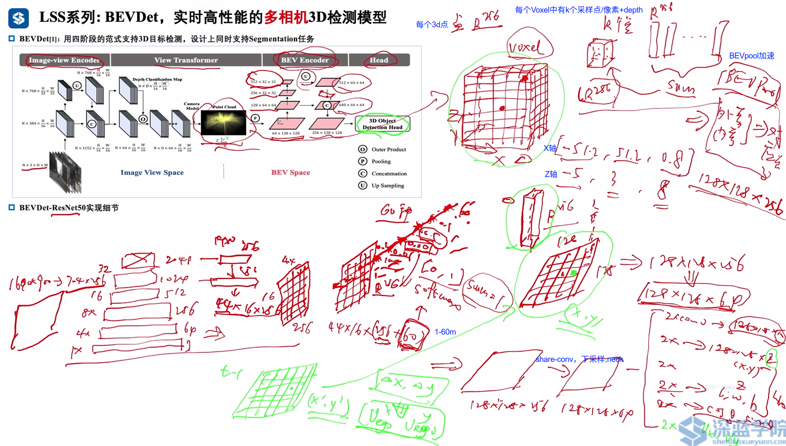
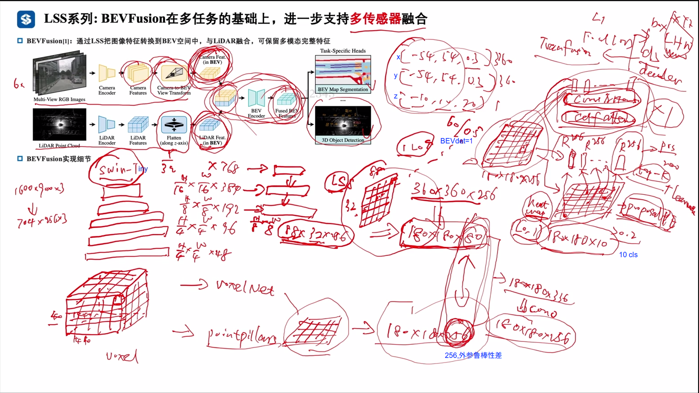
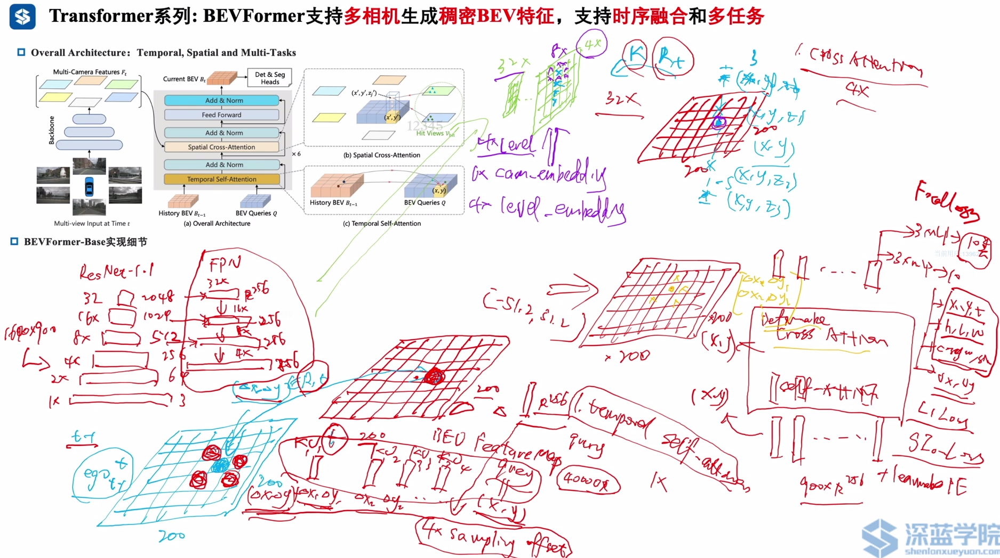
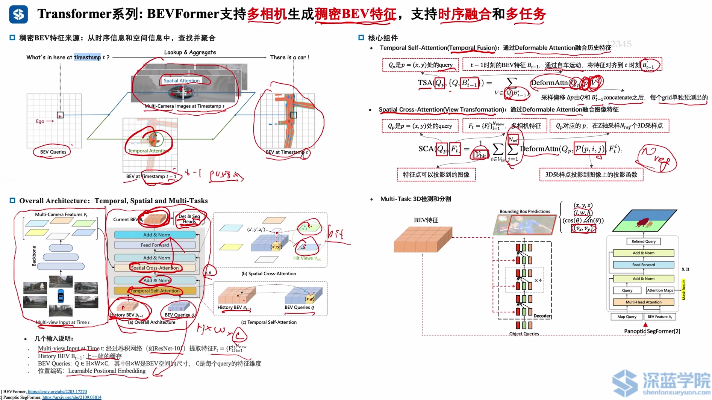
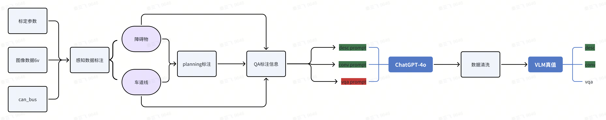
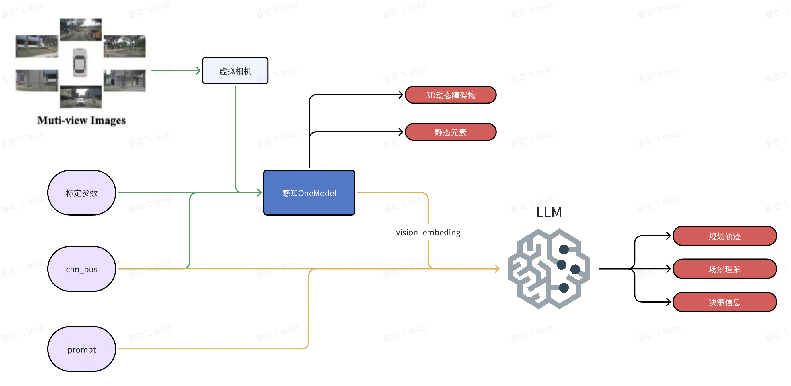
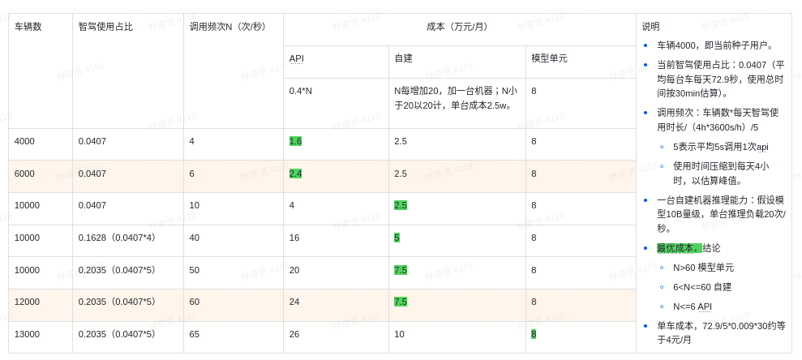

# 1.BEV
1. pointpillar
2. 

## Project 1 Vision Transformer 【DETR】
https://www.shenlanxueyuan.com/course/752/task/30320/show

## LSS转换【BEVDet】
1. 模型可分为3个阶段：https://www.shenlanxueyuan.com/course/752/task/30332/show
   1. 阶段1 Lift：首先提取图像特征，估计每个像素深度分布估计
      阶段2 Splat：将Lift的点特征压缩为BEV特征。PointPillars
      阶段3 Shoot：基于BEV特征，进行路径规划（不在本章节讨论范围）
2. 

## BEVdet

1. OD头
   分类头：2×conv -> 128*128*10: 10个class 
   剩下都是回归头
   2×conv -> 128*128*2: x,y
   2×conv -> 128*128*1: z
   2×conv -> 128*128*2: cos，sin
   2×conv -> 128*128*3: l,w,h
   2×conv -> 128*128*2: vx,vy

## BEVfusion

1. lidar处理
   1. Voxelnet、segrid?  4d卷积
   2. pointpillar：压缩高度
2. transfusion-->heatmap
3. 每个grid，[0,1]，取top-k(200)个proposal，互相做self-att
4. 然后一层cross-att
5. learnable PE
6. 

## BEV转换【BEVFormer】
https://www.shenlanxueyuan.com/course/752/task/30336/show

## BEVFormer

1. BEVDet 对FPN输出的每一层预测深度分布，再做其他事情
2. 位置编码体现在attention过程
3. 每个grid，query = 256维vector；一共200*200=4万
4. temporal self-attention：（1层）
   1. t时刻，一个query
   2. t-1时刻
      1. (dx, dy) 处理自车运动导致的位移
      2. deformable attention：预测周围4个sample offset(dx1，dy1)...，处理他车运动、自车dr不准、标定误差等 =4个KV

5. Spatial cross-attention（4层）
   1. deformable attention：每个query纵向(-5,3)设4个采样点，K|RT投影到 level cam
   2. 每个点预测8个像素点=32个点
   3. 32个点和bev query 做cross-attention --得到256维vec
   4. 4个level_embedding
   5. 6个cam_embedding

6. 特点
   1. 可应对外参不准
   2. 计算量较大
   3. 性能比BEVDet好

## PETR
1. DETR：
   1. 2d feature + 2d PE
   2. 2d query --> 2d detection
2. DETR3d
   1. 预测3d ref point，投影到2d，采样，更新query --> 3d detection
   2. 3d ref point很难学

3. PETR
   1. 3d PE 直接加到 2d feature。每个像素都带了3d信息，知道在3d空间的位置
   2. 直接用3d query decoder -> 3d detection
4. 特点
   1. 速度快
   2. 可学习的anchor points效果最好
   3. anchor points 数量 大于1500
## PETRv2

## Spare4D
https://zhuanlan.zhihu.com/p/637096473

# 2.occ线上开发

1. 数据集
   1. 4d label人工标注
   2. OD标注数据和Freespace标注数据聚合 -->单帧
   3. 静态点云语义赋予及叠加【处理遮挡问题】
   4. 动态障碍物语义赋予
   5. Voxel真值，分辨率0.2m
2. baseline：FlashOcc
   1. ViewTransform: 原始的算法是针对针孔相机模型开发的，需要修改成鱼眼虚拟相机模型
   2. loss：customFocalLoss
   3. BEV特征图：200*200，高度是实际物理区域：40 *40m。 # TODO occ高度=2m？
3. FlashOcc
   1. https://zhuanlan.zhihu.com/p/678409689
   2. 用2d-conv代替3d-conv
   3. 设计channel-to-height转换模块，实现将BEV空间的输出结果提升到3D体素空间.#TODO how?
4. FreepaceFusion 模块核心的算法模块是占据栅格地图的更新维护, GroundlineFusion后处理：ground line生成
5. 工程化
   1. INT8量化
   2. 稀疏计算
   3. 将训练好的模型权重转化为tensorrt

6. 存在问题
   •动态障碍物处理
   •检出距离过短
   •降低分辨率
   •道路边界平顺性异常
7. 解决后处理cornercase
   1. 问题：在拍平的过程中取了z_idx = 10的位置，这样处理是比较简单且不合理的，因为在障碍物离本车较近的时候，因为视野盲区等问题，在z_idx = 10 的位置没有检出。
   2. 解决：在坐标（x_idx, y_idx）位置，沿着z轴方向，向上索引，只有在z轴方向上存在一个被占用的格子，那（x_idx, y_idx）位置即被占用。
8. #TODO 超声波融合；和od结果是否融合？
9.  occ激光数据集问题
   •点云缺失
   •低矮障碍物与地面高度一致，并且点云语义赋予的不完全
   •路面有噪点，不干净
   •动静态物体重合
   •动态障碍物处理有问题
   •具有车语义，但与ego重叠的点云：车速低于0.25
   •类别错误
   •动态障碍物点云没有抠干净
   •路面有噪点
   •地面动态点云未扣干净
   •栏杆卡车里
   •路面语义不全

# 3.slot
1. yolox_nano：直接预测目标中心点及边界框尺寸
2. 车位后处理：选择离自车3米范围内的检测结果取更新车位的宽度，长度，角度以及限位器的位置；在泊入阶段保持不变；
3. dr 补偿航偏角，精度提升；
4. 典型问题
   1. 斜列漏检严重、不稳
   2. 轮档检测位置不准
   3. 水平车位误检漏检，占用属性错误
   4. 水平空车位无法抛库
   5. 检测车宽过长，撞路沿，--> 加入路沿检测  
5. 规划判断slot 可泊入属性

# 4.车道线车端问题
1. 固定点位误检、漏检
   地图鲜度问题
   真值处理问题
2. 固定模式漏检，如乡村、景区道路无车道线处漏检；复杂匝道漏检
   缺少对应数据、数据分布不平衡
3. 行车偏左/偏右
   优先检查传感器标定问题
   dataloader中进行适当的外参噪声处理

￮拥挤--城市路口
￮车道线属性（鱼骨线，可变车道）
￮匝道汇入汇出 
￮中心线导流线 
￮雨天 
￮夜晚
￮左虚右实，左实右虚，双实线，双虚线
￮虚实线分界

￮行车偏右 
￮宽车道
￮城区路口  (缺数据) 
▪停止线
▪斑马线
▪跨路口车道线
▪环岛
￮车道线拓扑
￮车道数量变化 
￮车道线颜色

# 5.端到端

## 930 demo方案

1. 数据集
  - 感知OneModel，主要包含6v图像数据，标定参数，自动运动状态，3D动态障碍物真值（位置、速度、类别），静态元素真值；
  - 规划，主要是Planning中WayPoint相关信息以及导航信息（左转，直行，右转）；
  - VQA视觉问答，主要包含场景理解，决策以及规划等文本类真值。

2. Pipeline未实现完全自动化，比如VQA真值的生产还是需要大量的人工修正
   1. 数据训练集规模大概在2w帧左右
   2. 基础数据要求同时要求有障碍物和静态元素的标签，而目前同时带有这两种类型基础数据规模还比较小
   3. qa相关的真值生产依赖chatgpt-4o生产，清洗大模型输出的结果耗时较长，后续采用基于云平台搭建的自动化生成工具，完善场景挖掘工具，快速扩大数据集的规模。
   

3. 模型架构
   1. 借鉴感知端到端模型的稀疏3D查询机制，实现VLM大模型与多视角输入进行交互，增强VLM对于3D空间的理解。
   2. vision-emb 输入给 llm
   
4. 模型问题
   1. 自车can_bus对轨迹影响较大：改变can_bus的值，比如增加前向速度，即使在需要停止的场景下，仍会生成前进的轨迹
   2. 对车道线检测效果不好：当前车道线检测head用的是petr head，是一种sparse query的方式，线上感知模型也证明了sparse query对于车道线的检测效果比dense query要差。
      1. 后续改成dense query的head，比如mapqr
   3. 
5. 训练耗时：在8xA100平台上，使用2万帧数据，训练20个epoch，需要24个小时。
6. 推理耗时：
   - Llama 7B：仅大语言模型（不包含视觉部分）的测试数据，假设输出为100个token，预计需要10秒以上，即0.1Hz/s
   - 将多个prompt，组合成一个batch进行推理。
   - 进一步量化，如4bit量化。
   - 选用其它推理框架，，如VLLM、TensorRT-LLM等
7. Planning评测
   1. 开环：3s轨迹内的L2欧式距离误差，后续需增加碰撞概率COL. Rate的评测指标。
   2. 闭环：在闭环仿真系统中，增加路径偏差和速度匹配分数（PDMS)、路线完成率（RC）以及Arena驾驶分数（ADS）

8. e2e联调问题
   1. 碰撞检测生效，退出闭环仿真
   2. 仿真器只提供原bag的时间戳。如果要提供更多时间戳，需要模拟更长的交通流序列

## 云端方案
1. 云端方案：
   1. vlm 输入图片+问答，输出给规划用，5s调用一次
   2. 
2. 基于OTA 4 multicast->vlm module->云api的链路打通，已有数据上云给到planning待适配开发
3. 车端->朗歌脱密服务->公有云（自研模型）
4. vlm module
   1. 1920图像压缩测试+精度对比正在进行
   2. crop上半部分问答效果不好，尝试更改prompt
   3.  基于提示词的优化。是否有电子绿色提示词->是否有左转/直行字样。
5. 场景：上海公交车道、左转、直行待行区、故障车、施工作业车辆、
6. 
## 车端方案
1.  本周会拿qwen-2B的模型部署实测下，再重新评估云端推理能力。