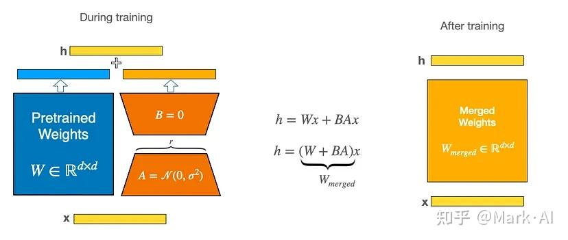
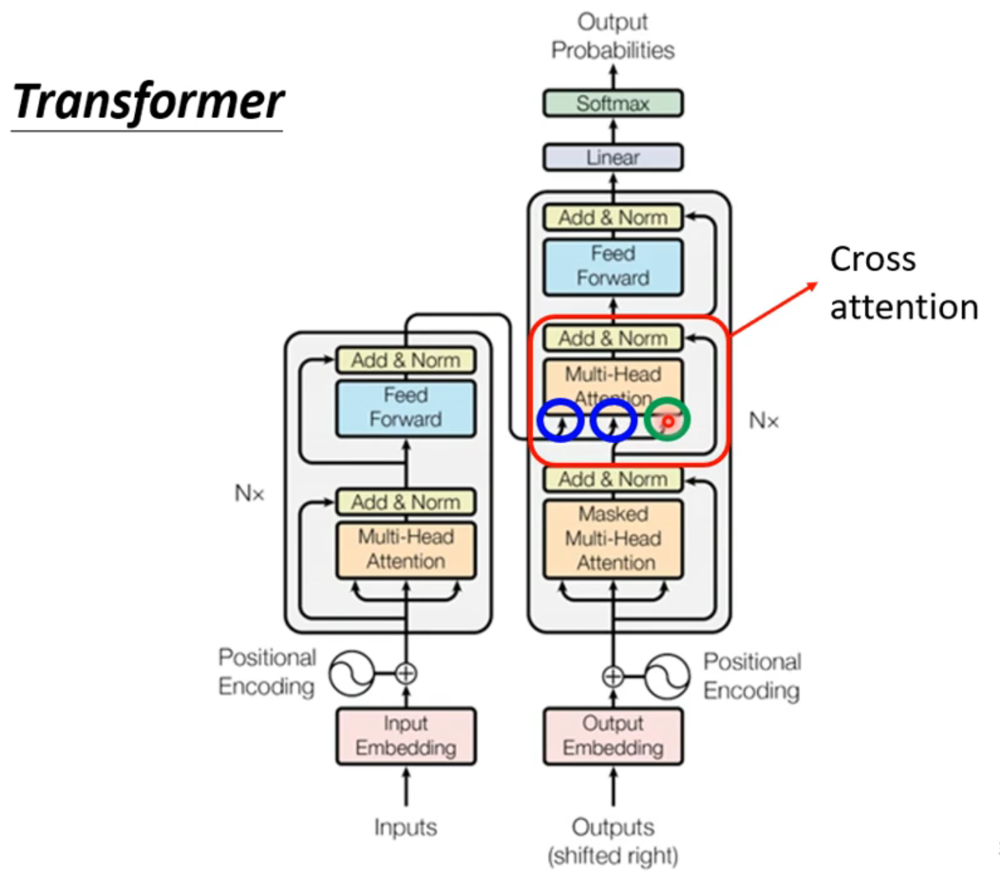
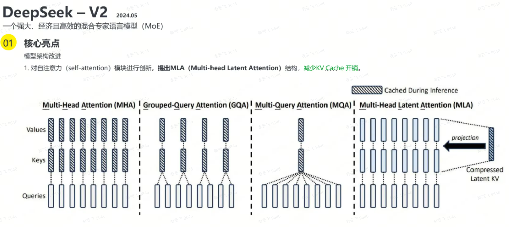
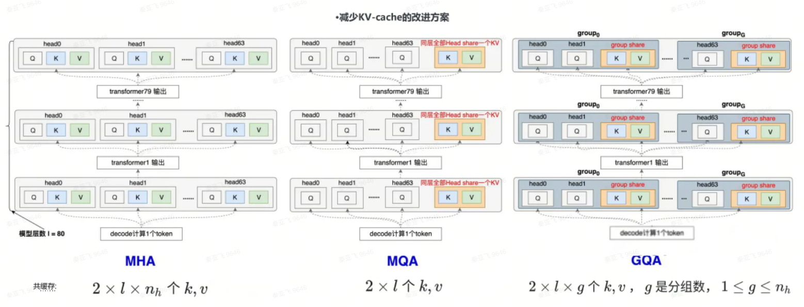
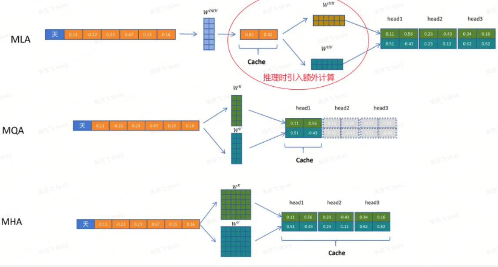
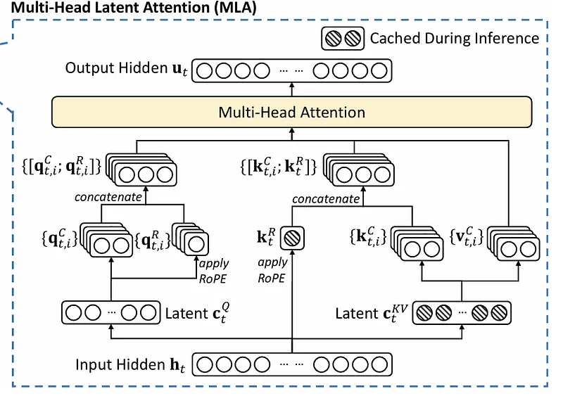

# 01. 大模型常用微调方法LORA和Ptuning的原理

W = W0 + ΔW = W0 + BA，其中W0（d*k）、A（d*r）和B（r*k），r << d、k。
A/B相当于一个Encoder一个Decoder。A初始化成高斯分布，B初始化=0
秩“r”是一个超参数（该论文建议使用1、2、4、8或64，其中4或8在大多数情况下效果最好）

```python
input_dim = 768 # e.g., the hidden size of the pre-trained model
output_dim = 768 # e.g., the output size of the layer
rank = 8 # The rank 'r' for the low-rank adaptation

W = ... # from pretrained network with shape input_dim x output_dim

W_A = nn.Parameter(torch.empty(input_dim, rank)) # LoRA weight A
W_B = nn.Parameter(torch.empty(rank, output_dim)) # LoRA weight B

# Initialization of LoRA weights
nn.init.kaiming_uniform_(W_A, a=math.sqrt(5))
nn.init.zeros_(W_B)

def regular_forward_matmul(x, W):
    h = x @ W
return h

def lora_forward_matmul(x, W, W_A, W_B):
    h = x @ W  # regular matrix multiplication
    h += x @ (W_A @ W_B)*alpha # use scaled LoRA weights
return h
```
------
Lora方法的核心是在大型语言模型上对指定参数增加额外的低秩矩阵，也就是在原始PLM旁边增加一个旁路，做一个降维再升维的操作。并在模型训练过程中，固定PLM的参数，只训练降维矩阵A与升维矩阵B。

Ptuning方法的核心是使用可微的virtual token替换了原来的discrete tokens，且仅加入到输入层，并使用prompt encoder（BiLSTM+MLP）对virtual token进行编码学习。

更详细请查阅[使用 LoRA（低阶适应）微调 LLM](https://zhuanlan.zhihu.com/p/672999750)


# 18. 大模型微调的LORA原理及Lora怎么训练？

[大模型实战：使用 LoRA（低阶适应）微调 LLM](https://zhuanlan.zhihu.com/p/672999750)

# 19. lora的矩阵怎么初始化？为什么要初始化为全0？

[大模型实战：使用 LoRA（低阶适应）微调 LLM](https://zhuanlan.zhihu.com/p/672999750)


# 03. 为何现在的大模型大部分是Decoder only结构

大模型从模型架构上主要分为三种：Only-encoder, Only-Decoder, Encoder-Decoder三种模型架构

- Only-encoder：例如BERT，通过在大规模无标签文本上进行预训练，然后在下游任务上进行微调，具有强大的语言理解能力和表征能力。

- Only-Decoder: 例如GPT，通过在大规模无标签文本上进行预训练，然后在特定任务上进行微调，具有很强的生成能力和语言理解能力。

- Encoder-Decoder：例如T5（Text-to-Text Transfer Transformer）可以用于多种自然语言处理任务，如文本分类、机器翻译、问答等。

而LLM之所以主要都用Decoder-only架构，除了训练效率和工程实现上的优势外，在理论上是因为Encoder的双向注意力会存在低秩问题，这可能会削弱模型表达能力，就生成任务而言，引入双向注意力并无实质好处。而Encoder-Decoder架构之所以能够在某些场景下表现更好，大概只是因为它多了一倍参数。所以，在同等参数量、同等推理成本下，Decoder-only架构就是最优选择了。

# 04. 如何缓解 LLMs 复读机问题

- 多样性训练数据：在训练阶段，尽量使用多样性的语料库来训练模型，避免数据偏差和重复文本的问题。
- 引入噪声：在生成文本时，可以引入一些随机性或噪声，例如通过采样不同的词或短语，或者引入随机的变换操作，以增加生成文本的多样性。
- 温度参数调整：温度参数是用来控制生成文本的多样性的一个参数。通过调整温度参数的值，可以控制生成文本的独创性和多样性，从而减少复读机问题的出现。
- 后处理和过滤：对生成的文本进行后处理和过滤，去除重复的句子或短语，以提高生成文本的质量和多样性。
- Beam搜索调整：在生成文本时，可以调整Beam搜索算法的参数。Beam搜索是一种常用的生成策略，它在生成过程中维护了一个候选序列的集合。通过调整Beam大小和搜索宽度，可以控制生成文本的多样性和创造性。
- 人工干预和控制：对于关键任务或敏感场景，可以引入人工干预和控制机制，对生成的文本进行审查和筛选，确保生成结果的准确性和多样性。

更详细请查阅[大模型常见面试题解](https://blog.csdn.net/weixin_36378508/article/details/133809694
)

# 05. 为什么transformer块使用LayerNorm而不是BatchNorm #TODO add link

Batch Normalization 是对这批样本的同一维度特征做归一化， Layer Normalization 是对这单个样本的所有维度特征做归一化。LN不依赖于batch的大小和输入sequence的长度，因此可以用于batchsize为1和RNN中sequence的normalize操作。

- 为什么BN在NLP中效果差
  
  - BN计算特征的均值和方差是需要在batch_size维度，而这个维度表示一个特征，比如身高、体重、肤色等，如果将BN用于NLP中，其需要对每一个单词做处理，让每一个单词是对应到了MLP中的每一个特征明显是违背直觉得；
  - BN是对单词做缩放，在NLP中，单词由词向量来表达，本质上是对词向量进行缩放。词向量是什么？是我们学习出来的参数来表示词语语义的参数，不是真实存在的。

- 为什么LayerNorm单独对一个样本的所有单词做缩放可以起到效果
  
  - layner-norm 针对每一个样本做特征的缩放。换句话讲，保留了N维度，在C/H/W维度上做缩放。
  - layner-norm 也是在对同一个特征下的元素做归一化，只不过这里不再是对应N（或者说batch size），而是对应的文本长度。

# 06. Transformer为何使用多头注意力机制

多头保证了transformer可以注意到不同子空间的信息，捕捉到更加丰富的特征信息。论文原作者发现这样效果确实好，更详细的解析可以查阅[Multi-head Attention](https://www.zhihu.com/question/341222779)

# 07. 监督微调SFT后LLM表现下降的原因

SFT（Supervised Fine-Tuning）是一种常见的微调技术，它通过在特定任务的标注数据上进行训练来改进模型的性能。然而，SFT可能会导致模型的泛化能力下降，这是因为模型可能过度适应于微调数据，而忽视了预训练阶段学到的知识。这种现象被称为**灾难性遗忘**，可以使用一些策略，如：

- 使用更小的学习率进行微调，以减少模型对预训练知识的遗忘。
- 使用正则化技术，如权重衰减或者早停，以防止模型过度适应微调数据。
- 使用Elastic Weight Consolidation（EWC）等技术，这些技术试图在微调过程中保留模型在预训练阶段学到的重要知识。


# 09. 连接文本和图像的CLIP架构简介

CLIP 本质上就是拿图片特征和文本特征做余弦相似度对比。构建⼤规模的图像-⽂本数据构建（⽂本，图像）pair对，在其他下游⼦任务中取得极⾼的zero-shot指标。
优点：泛化性能强，特征在同⼀空间下衡量，模型简单不需要额外训练。
缺陷：⽂本描述简单“A photo of a xxx”，图⽂理解能⼒偏弱

-----


CLIP 把自然语言级别的抽象概念带到计算机视觉里了。确定一系列query，然后通过搜索引擎搜集图像，最后通过50万条query，搜索得到4亿个图像文本对。然后将Text Decoder从文本中提取的语义特征和Image Decoder从图像中提取的语义特征进行匹配训练。

[如何评价OpenAI最新的工作CLIP](https://www.zhihu.com/question/438649654)


# 10. BERT用于分类任务的优点，后续改进工作有哪些？

在分类任务中，BERT的结构中包含了双向的Transformer编码器（双向自注意力机制实现上下文的全局建模），这使得BERT能够更好地捕捉文本中的双向上下文信息，从而在文本分类任务中表现更好。BERT的后续改进工作主要包括以下方面：

- 基于BERT的预训练模型的改进，例如RoBERTa、ALBERT等；
- 通过调整BERT的架构和超参数来进一步优化模型性能，例如Electra、DeBERTa等；
- 改进BERT在特定任务上的应用方法，例如ERNIE、MT-DNN等；


# 11. 介绍transformer算法

Transformer本身是一个典型的encoder-decoder模型。
Encoder端和Decoder端均有6个Block，Encoder端的Block包括两个模块，多头self-attention模块以及一个前馈神经网络模块。
Decoder端的Block包括三个模块，多头self-attention模块，多头Encoder-Decoder attention交互模块，以及一个前馈神经网络模块。【】
需要注意：Encoder端和Decoder端中的每个模块都有残差层和Layer Normalization层。
还有位置编码。

q来自decoder，k和v来自encoder，叫做cross attention；还有不同cross attention的方式：k/v不来自最后一层


# 14. 在大型语言模型 (llms) 中减少幻觉的策略有哪些？

- DoLa：通过对比层解码提高大型语言模型的真实性：大型预训练 LLM 中的简单解码策略可减少幻觉;
- 在高质量数据上微调模型——在高质量数据上微调小型法学硕士模型已显示出有希望的结果，并有助于减少幻觉;
- 上下文学习：使用上下文学习为模型提供更好的上下文;
- 限制：将输出限制为受限列表，而不是自由浮动文本;

[LLMS](https://medium.com/@masteringllm/4-interview-questions-on-large-language-models-llms-1447516a8db4)


# 15. 你能否概括介绍一下 ChatGPT 的训练过程？

- 𝗣𝗿𝗲-𝘁𝗿𝗮𝗶𝗻𝗶𝗻𝗴：预训练，大型语言模型在来自互联网的广泛数据集上进行训练，其中 Transformer 架构是自然语言处理的最佳选择，这里的主要目标是使模型能够预测给定文本序列中的下一个单词。此阶段使模型具备理解语言模式的能力，但尚未具备理解指令或问题的能力。

- 监督微调或者指令微调。模型将用户消息作为输入，模型通过最小化其预测与提供的响应之间的差异来学习生成响应，此阶段标志着模型从仅仅理解语言模式到理解并响应指令的转变。

- 采用人类反馈强化学习 (RLHF) 作为后续微调步骤。

# 16. 在大型语言模型 (llms) 上下文中的标记是什么？

将输入文本分解为多个片段，每一部分大约是一个单词大小的序列，我们称之为子词标记，该过程称为标记化。标记可以是单词或只是字符块。


# 24. 领域数据训练后，通用能力往往会有所下降，如何缓解模型遗忘通用能力?

为了解决这个问题通常在领域训练的过程中加入通用数据集。那么这个比例多少比较合适呢？目前还没有一个准确的答案。主要与领域数据量有关系，当数据量没有那么多时，一般领域数据与通用数据的比例在1:5到1:10之间是比较合适的。

# 25. 在大型语言模型 (llms)中数据模态的对齐如何处理？

-  Qformer
BLIP2：将图像特征对齐到预训练语言模型
BLIP-2 通过在冻结的预训练图像编码器和冻结的预训练大语言模型之间添加一个轻量级 查询 Transformer (Query Transformer, Q-Former) 来弥合视觉和语言模型之间的模态隔阂。在整个模型中，Q-Former 是唯一的可训练模块，而图像编码器和语言模型始终保持冻结状态。


BLIP：通过多路损失函数，以及图像分快理解策略等算法，构建⾼质量的图像理解模型。
BLIP2：在BLIP基础上，利用Q-Former构建图像与⼤语⾔模型之间的桥梁，充分利⽤⼤语⾔模型⾃身的预训练能⼒

为什么BLIP/BLIP2的特征没法直接⽤？
因为受到⽂图⼀致性等隐形损失约束，相关特征不再同⼀个特征空间下（⽆法直接⽤距离衡量⽂图特征的相似性），因此⽆法像CLIP⼀样“直接”接⼊模型中使⽤

https://cloud.tencent.com/developer/article/2353722?from=15425

# 26. 训练通用目标检测器常会使用多源图像进行训练，如何处理新类别歧视？

- Detecting Everything in the Open World: Towards Universal Object Detection
UniDetector

# 27. 举例说明强化学习如何发挥作用？

一般来说，强化学习 (RL) 系统由两个主要组件组成：代理和一个环境；


- 环境是智能体正在作用的设置，智能体代表强化学习算法。
- 当环境向代理发送一个状态时，强化学习过程就开始了，然后代理根据其观察结果采取行动来响应该状态。
- 反过来，环境将下一个状态和相应的奖励发送回代理。代理将使用环境返回的奖励来更新其知识，以评估其最后的行动。
- 循环继续，直到环境发送终止状态，这意味着代理已完成其所有任务。

为了更好地理解这一点，我们假设我们的智能体正在学习玩反击游戏。RL 过程可以分为以下步骤：

- RL 代理（玩家 1）从环境中收集状态 S⁰（反恐精英游戏）
- 基于状态 S⁰，RL 代理采取操作 A⁰（操作可以是任何导致结果的操作，即代理在游戏中向左或向右移动）。最初，动作是随机的
- 境现在处于新状态 S1（游戏中的新阶段）
- 强化学习代理现在从环境中获得奖励 R1。该奖励可以是额外的积分或金币
- 这个 RL 循环一直持续到 RL 代理死亡或到达目的地为止，并且它不断输出一系列状态、动作和奖励。

# 28. 如何理解强化学习中的奖励最大化？

奖励最大化是强化学习的一个关键概念。人工智能代理试图采取行动，随着时间的推移从其环境中获得最大的回报。代理从奖励或惩罚形式的输入中学习，并改变其行为方式以更好地完成工作。目标是让智能体足够聪明，能够从经验中学习并做出选择，帮助他们尽快实现长期目标。

# 29. 如何提升大语言模型的Prompt泛化性？

- 使用多个不同的prompt，从而增加模型学习的样本多样性。
- 通过在prompt中添加随机噪声或变换，来增加数据集的丰富性，从而提高模型的泛化性能。
- 采用迁移学习或元学习等方法，从先前学习的任务中提取知识，并将其应用于新的任务中。

# 30. Instruction Tuning与Prompt tuning方法的区别？

- Prompt tuning:针对每个任务，单独生成prompt模板（hard prompt or soft prompt），然后在每个任务上进行full-shot微调与评估，其中预训练模型参数是freeze的。Prompt是去激发语言模型的补全能力，比如给出上半句生成下半句、或者做完形填空，都还是像在做language model任务。
- Instruction Tuning：针对每个任务，单独生成instruction（hard token），通过在若干个full-shot任务上进行微调，然后在具体的任务上进行评估泛化能力（zero shot），其中预训练模型参数是**unfreeze**的。Instruction Tuning则是激发语言模型的理解能力，通过给出更明显的指令/指示，让模型去理解并做出正确的action。

[Instruction Tuning](https://zhuanlan.zhihu.com/p/558286175)

# 31. 知识蒸馏是将复杂模型的知识转移到简单模型的方法，针对知识蒸馏有哪些改进点？

- 使用不同类型的损失函数和温度参数来获得更好的知识蒸馏效果。
- 引入额外的信息来提高蒸馏的效果，例如将相似性约束添加到模型训练中。
- 将蒸馏方法与其他技术结合使用，例如使用多任务学习和迁移学习来进一步改进知识蒸馏的效果。


# 33. 进行SFT操作的时候，基座模型选用Chat还是Base?

在进行SFT实验的时候，大模型选用Chat还是Base作为基座，需要根据SFT的数据量进行决定。如果你只拥有小于10k数据，建议你选用Chat模型作为基座进行微调；如果你拥有100k的数据，建议你在Base模型上进行微调。

# 34. 开源大模型进行预训练的过程中会加入书籍、论文等数据，这部分数据如何组织与处理?

进行大模型预训练时书籍和论文的文本就按照段落拆分就可以。如果进行有监督的微调任务，就需要转成指令格式的数据集，可以用标题或者关键短语作为提示。

# 35. 你能提供一些大型语言模型中对齐问题的示例吗?

一致性问题是指模型的目标和行为与人类价值观和期望的一致性程度。大语言模型，例如GPT-3，接受来自互联网的大量文本数居的训练，并且够生成类似人类的文本，但它们可能并不总是产生与人类期望或理想值一致的输出。大型语言模型中的对齐问题通常表现为
- 缺乏帮助: 当模型没有遵循用户的明确指令时
- 幻觉: 当模型编造不存在或错误的事实时。
- 缺乏可解释性: 人类很难理解模型如何得出特定决策或预测
- 生成有偏见或有毒的输出: 当受有偏见/有毒数据训练的语言模型可能会在其输出中重现该输出时，即使没有明确指示这样做。

# 36. Adaptive Softmax在大型语言模型中有何用处？

自适应Softmax在大型语言模型中非常有用，因为它可以在处理大型词汇表时进行有效的训练和推理，传统的Softmax涉及计算词汇表中每个单词的概率率，随着词汇量的增长，计算成本可能会变得昂贵。

自适应Softmax根据单词的常见程度将单词分组到簇中，从而减少了所需的计算量。这减少了计算词汇表概率分布所需的计算量。通过使用自适应softmax，可以更有效地训练和运行大型语言模型，从而实现更快的实验和开发。

# 38. 如何解决chatglm微调的灾难性遗忘问题？

https://zhuanlan.zhihu.com/p/628438318 没解答

# 40. GPT3、LLAMA的Layer Normalization 的区别是什么？

- GPT3：采用了Post-Layer Normalization（后标准化）的结构，即先进行自注意力或前馈神经网络的计算，然后进行Layer Normalization。这种结构有助于稳定训练过程，提高模型性能。

- LLAMA：采用了Pre-Layer Normalization（前标准化）的结构，即先进行Layer Normalization，然后进行自注意力或前馈神经网络的计算。这种结构有助于提高模型的泛化能力和鲁棒性。


# 42. 推理优化技术 Flash Attention 的作用是什么？

Flash Attention 是一种高效的注意力机制实现，如共享张量核心和高效的内存使用，以减少内存占用并提高计算速度。这种方法特别适用于具有长序列和大型模型参数的场景，例如自然语言处理和推荐系统。

# 43. ZeRO，零冗余优化器的三个阶段？

ZeRO-1：优化器状态分区
ZeRO-2：优化器状态+梯度分区
ZeRO-3（也称为FSDP）：优化器状态+梯度+参数分区

# 44. 模型架构：对于Qwen-VL模型的输入，图像是如何处理的？它们经过视觉编码器和适配器后得到了怎样的特征序列？ #TODO - 

- https://www.zhihu.com/question/619091330/answer/3260054120

# 38. LangChain 通常被用作「粘合剂」，将构建 LLM 应用所需的各个模块连接在一起，请介绍下其核心模块？

- Models：模型，是各种类型的模型和模型集成。
- Prompts：提示，包括提示管理、提示优化和提示序列化。
- Memory：记忆，用来保存和模型交互时的上下文状态。
- Indexes：索引，用来结构化文档，以便和模型交互。包括文档加载程序、向量存储器、文本分割器和检索器等。
- Agents：代理，决定模型采取哪些行动，执行并且观察流程，直到完成为止。
- Chains：链，一系列对各种组件的调用。


# 44. Mamba 对 RNN 做了哪些改变，从而在GPU上可以算的比较快？ #TODO - 

https://www.zhihu.com/question/644981978

# 45. 多头注意力机制MHA是Transformer模型中的核心组件, KV Cache和GQA优化的核心思想？

KV Cache（Key-Value Cache）：

- KV Cache是一种在自回归生成模型中使用的优化技术，它通过缓存历史输入的Key（K）和Value（V）来减少重复计算，从而提高推理效率。
- 在生成式模型的推理过程中，由于每个新生成的token都会与之前的token一起作为下一次输入，因此可以利用- KV Cache来避免对相同token的重复计算。
- KV Cache的显存占用会随着输入序列长度和输出序列长度的增加而线性增长，因此需要对其进行优化以适应更长的序列

Grouped Query Attention (GQA)：

- GQA是一种介于MHA和MQA之间的折中方案，它将查询头（Query Heads）分组，并在每组中共享一个键头（Key Head）和一个值头（Value Head）。
- GQA既保留了多头注意力的一定表达能力，又通过减少内存访问压力来加速推理速度。
- GQA可以通过对已经训练好的模型进行微调来实现，使用mean pooling来生成共享的KV，这种方法在保持推理速度的同时也能保持较高的模型质量





| 特性                | MHA（多头注意力）         | GQA（分组查询注意力）       | MQA（多查询注意力）          |
|---------------------|--------------------------|----------------------------|-----------------------------|
| 键值共享            | 不共享                   | 组内共享                   | 全局共享                    |
| 内存占用            | 高（每个头独立存储KV）   | 中等                       | 低                          |
| 表达能力            | 最强                     | 较强                       | 较弱                        |
| 适用场景            | 高性能需求（如GPT-4）    | 平衡效率与性能（如Llama2） | 低资源场景（如边缘设备）    |

MLA（Multi-Head Latent Attention），优化 KV 缓存的计算与存储效率。
- ​低秩联合压缩：将高维键值矩阵投影到低维潜在空间（Latent Vector），减少存储需求（例如将 576 维的键值压缩为 64 维潜在向量）。
- 解耦 RoPE（旋转位置编码）与注意力计算，避免额外计算开销


## 09. Attention计算复杂度以及如何改进

- 代码中的to_qkv()函数，即用于生成q、k、v三个特征向量


```python
self.to_qkv = nn.Linear(dim, inner_dim * 3, bias=False)
self.to_out = nn.Linear(inner_dim, dim)
```

标准自注意力机制的时间复杂度 ​O(n²d)，空间复杂度 ​O(n²) ，​n：输入序列长度，​d：嵌入维度（特征维度）
1. 稀疏化注意力：限制每个位置仅关注局部窗口或关键位置（如滑动窗口、随机采样）
2. 分块计算（FlashAttention）​：将Q、K、V矩阵分块加载到GPU高速缓存（SRAM），减少HBM访问次数
3. 近似注意力机制
  (1) 核化线性注意力（Kernel-based Attention）​，用特征映射φ(Q)φ(K)^T替代QK^T，利用矩阵结合律重构计算顺序
  (2) 低秩分解（Low-Rank Attention）​对QK^T矩阵进行奇异值分解（SVD），保留前k个主成分；
1. Multi-Query Attention (MQA)：所有注意力头共享同一组K、V矩阵，减少KV缓存
2. Grouped-Query Attention (GQA)：将头分组，每组共享KV矩阵，平衡MQA的效率与MHA的表达能力

| 方法              | 复杂度     | 优点                  | 局限性               | 适用场景              |
|-----------------------|----------------|---------------------------|--------------------------|--------------------------|
| 稀疏注意力            | O(n logn)      | 显存占用低                | 牺牲长程依赖捕捉能力     | 局部相关性强的任务（如CV）|
| 核化线性注意力 | O(nd²)         | 严格线性复杂度            | 需设计有效核函数         | 长序列生成（文本/视频）   |
| MQA/GQA           | O(n²d/h)       | 推理速度快                | 表达能力受限             | 资源受限的端侧部署        |
| FlashAttention| O(n²d)（实际加速）| 无需修改模型结构          | 需定制CUDA内核           | 训练加速与显存优化        |

## 32. Transformer中的Attention计算复杂度以及如何改进？

在标准的Transformer中，attention计算的时间复杂度为O(N^2)，其中N是输入序列的长度。为了降低计算复杂度，可以采用以下几种方法：

- 使用自注意力机制，减少计算复杂度。自注意力机制不需要计算输入序列之间的交叉关系，而是计算每个输入向量与自身之间的关系，从而减少计算量。
- 使用局部注意力机制，只计算输入序列中与当前位置相关的子序列的交互，从而降低计算复杂度。
- 采用基于近似的方法，例如使用随机化和采样等方法来近似计算，从而降低计算复杂度。
- 使用压缩注意力机制，通过将输入向量映射到低维空间来减少计算量，例如使用哈希注意力机制和低秩注意力机制等。

## 41. MHA多头注意力和MQA多查询注意力的区别？

- 与MHA不同的是，MQA 让所有的头之间共享同一份 Key 和 Value 矩阵，每个头只单独保留了一份 Query 参数，从而大大减少 Key 和 Value 矩阵的参数量。
# 47. 100B以上的大模型预训练中出现loss spike的原因及解决方法？

- 参考论文 < A Theory on Adam Instability in Large-Scale Machine Learning >
- 知乎解读 https://zhuanlan.zhihu.com/p/675421518

# 37. 模型问题：多模态大模型常采用MLP作为视觉映射器，将视觉特征到token一对一地映射到文本空间, 如何压缩视觉token量以提升效率？ #TODO - 

TokenPacker
- 知乎解读 https://zhuanlan.zhihu.com/p/707021763

# 47. 数据准备：在处理对话及语料数据时，针对数据去重用了哪些算法，针对语料训练阶段的数据增强做了哪些？

- 知乎解读 https://zhuanlan.zhihu.com/p/712494477

# 48. 数据准备：LLaMa3.1的微调进行了几轮，奖励模型的训练数据和SFT的训练数据用了什么？

- 关于LLaMa3.1的相关问题，https://zhuanlan.zhihu.com/p/712494477

# 38. 模型问题：VLM模型中高分辨率图像降低token数的几种方式？

- https://zhuanlan.zhihu.com/p/720428373 #TODO - 

# 49. 模型推理：现有技术范式下，广义幻觉？

现有技术范式下，广义幻觉只能靠外挂 RAG、function_call 的方式来解决；
狭义幻觉的缓解方式其实还是调参数；

# 52. 模型推理：LLM推理时Decode阶段一次迭代一个token，内存耗时更多，有什么对应的加速方法？ #TODO - 

- https://zhuanlan.zhihu.com/p/699776257

# 53. 模型推理：大模型训练及微调的显存占用情况？


# 55. 模型训练：大模型训练阶段的耗时在哪里？比如涉及到千卡的训练。

pytorch步骤，4-7最耗时
1. dataset读取数据，构建输出
2. dataloader collate数据，进行数据预处理
3. 模型forward计算输出
4. loss compute
5. 模型backward计算梯度
6. 模型sync梯度
7. 优化器step更新权重
8. 打印log
- https://www.zhihu.com/question/650979052/answer/3501160453

# 56. 模型优化：在SFT过程中Prompt优化是重要的一步，比如在商品分类的任务中，原提示词可能只包含了类别信息？

https://zhuanlan.zhihu.com/p/17193156687

# 57. 模型训练：SFT和RL分别对基座大模型的作用和影响是什么？

SFT作用通过在特定任务，通常为指令格式的数据集上训练预训练模型，使其适应下游任务。
- SFT 倾向于记忆训练数据，在基于规则的文本和视觉环境中都难以泛化到分布外的数据。
- SFT 对于有效的 RL 训练仍然非常重要：SFT 可以稳定模型的输出格式，使得后续的 RL 能够实现性能的提升。

RL作用用于使模型与人类偏好对齐，或训练基础模型来解决特定任务。
- RL在基于规则的文本和视觉环境中均能展现出泛化能力。
- RL在复杂的、多模态任务中泛化能力强，且可以提升模型潜在的视觉识别能力，有助于增强视觉领域泛化能力。

# 58. 模型训练：RL/SFT 如何影响视觉语言模型（VLM）中的视觉识别能力？

RL提高了视觉识别准确率，而SFT降低了视觉识别准确率和整体性能。