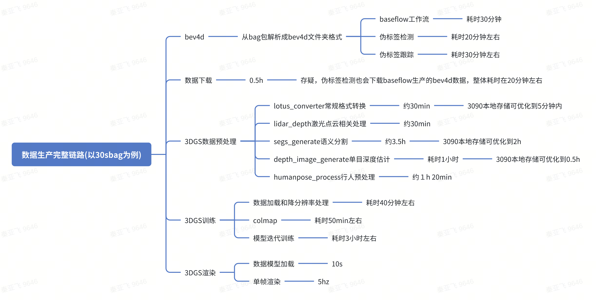

# 1. 3DGS中常见的可训练参数：

1. 位置信息（Position）。初始点云来自sfm
2. 透明度信息（Opacity）
3. 协方差矩阵（Covariance Matrix）
    Σ=R S S^t R^t 缩放矩阵和旋转矩阵 
4. 颜色/球谐函数（Spherical Harmonics, SH）​。优化目标：通过训练视图的像素颜色对比（L1损失和D-SSIM损失）调整SH系数

# 2. 在训练过程中，这些参数通过优化损失函数来更新。常见的损失函数包括：

渲染损失：通过比较渲染图像和目标图像之间的差异来计算损失。
正则化损失：用于防止过拟合，例如 L2 正则化。
几何损失：用于确保高斯散射点的几何结构合理，例如距离损失、平滑损失等。

# 3. streetgs整体流程

1. 预处理
  1. generate streetguassians format data from raw bev4d format data
  2. panda128点云建图/egopose优化/Generating LiDAR depth
    1. 或者colmap，加上尺度估计
  3. 静态车道线自动标注，mapQR
  4. 动态障碍物自动标注，centerpoint+后处理
  5. 语义分割、实例分割，detetron/mask2former，用车辆、地面、天空等像素分割结果做监督
  6. 红绿灯标注
  7. 行人SMPL提取【PHALP(Predicting Human Appearance, Location and Pose)】
2. 3dgs重建
  1. 7v、6v渲染
  2. 2d_gaussian作为base
  3. 时间加入傅里叶编码-->SH
  4. loss：
    1. 颜色rgb：ssmi + L1
    2. 正则化：opacity sparse loss，0或1
    3. scale loss
    4. camera id rgb offset，解决相机曝光参数不一样的影响。
    5. lidar_depth/colmap depth/image depth
    6. normal，以及depth_to_normal　loss
    7. semantic：sky、地面、object
    8. Pose 矫正
3. 渲染

# NeRF训练的前向过程主要包括以下步骤：

空间点采样：对于每个相机光线，我们在其路径上采样一系列3D点。这些点在沿着射线的空间中均匀分布或根据某种策略（如细粒度采样）进行分布。

位置编码：为了使神经网络能够更好地处理空间位置信息，通常会对采样的3D点坐标和观察方向进行高维位置编码（Positional Encoding）。这是一种将输入信号映射到更高维度的方法，以捕获不同频率的信息。

MLP查询：将经过位置编码的点坐标和方向作为输入传递给一个多层感知器（MLP）。MLP输出每个点的体积密度（volume density）和视图方向相关的发射颜色（emitted color）。

体绘制（Volume Rendering）：对MLP的输出应用体绘制技术，计算沿射线的颜色和不透明度。这涉及到积分操作，以确定最终像素颜色和权重。

损失计算：将渲染出的图像与真实图像进行比较，计算损失（通常是均方误差MSE），用于指导模型训练。

# NeRF模型的训练参数包括但不限于：

网络架构：通常是一个深层的全连接MLP，具有跳跃连接（skip connections）。
激活函数：ReLU常被用作激活函数。
优化器：Adam优化器是常用的优化方法。
学习率：初始学习率及其调度策略（例如逐步降低）。
批量大小：每次迭代使用的图像或光线数量。
位置编码：用于增强输入特征表达能力的位置编码参数，如频率带宽。
采样策略：粗略采样和精细采样（coarse and fine sampling），后者基于前者的预测结果进行调整。
正则化：可能包括L2正则化等技术，以防止过拟合。
训练时长：迭代次数或直到满足特定条件（如损失收敛）。

在实际实现中，具体的参数选择会根据数据集、硬件资源以及所需的性能而变化。NeRF训练过程可能会非常耗时，尤其是对于复杂的场景和高分辨率图像。因此，在实践中经常会使用GPU加速来提高训练效率。

