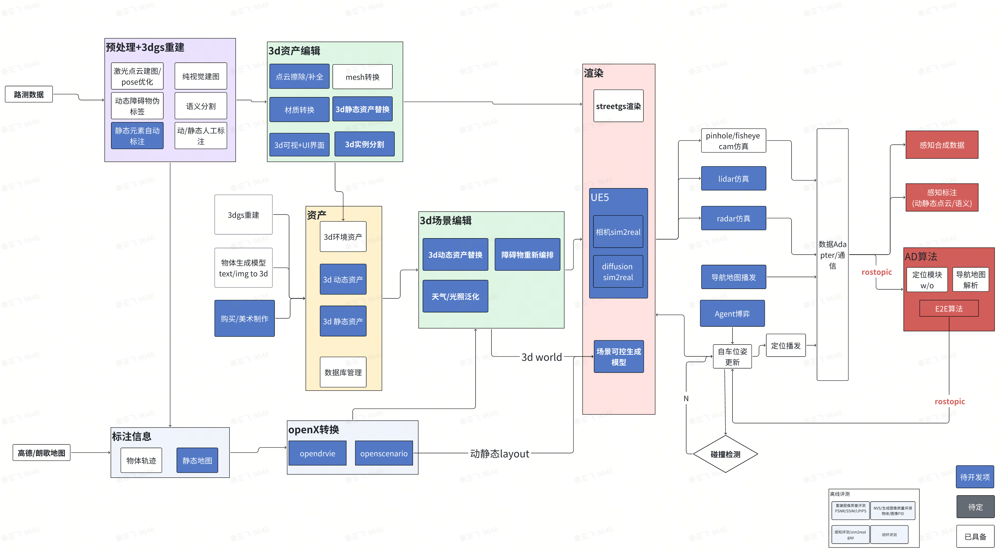
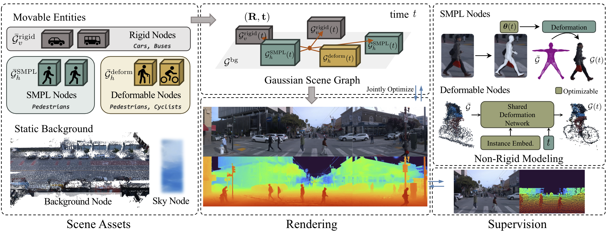

# 1. 3DGS

1. 3DGS中常见的可训练参数：
   1. 位置信息（Position）。初始点云来自sfm
   2. 透明度信息（Opacity）
   3. 协方差矩阵（Covariance Matrix）
       Σ=R S S^t R^t 缩放矩阵和旋转矩阵 
   4. 颜色/球谐函数（Spherical Harmonics, SH）​。优化目标：通过训练视图的像素颜色对比（L1损失和D-SSIM损失）调整SH系数
   5. 语义class_labels、scales

2. 在训练过程中，这些参数通过优化损失函数来更新。常见的损失函数包括：
    渲染损失：通过比较渲染图像和目标图像之间的差异来计算损失。
    正则化损失：用于防止过拟合，例如 L2 正则化。
    几何损失：用于确保高斯散射点的几何结构合理，例如距离损失、平滑损失等。

3. streetgs整体流程
    1. 预处理
      1. generate streetguassians format data from raw bev4d format data
      2. panda128点云建图/egopose优化/Generating LiDAR depth
        1. 或者colmap，加上尺度估计
      3. 静态车道线自动标注，mapQR
      4. 动态障碍物自动标注，centerpoint+后处理
      5. 语义分割、实例分割，detetron/mask2former，用车辆、地面、天空等像素分割结果做监督
      6. 红绿灯标注，作为动态obj
      7. 行人SMPL提取【PHALP(Predicting Human Appearance, Location and Pose)】【行人OD bbox来自于伪标签】
    2. 3dgs重建
      1. 7v、6v渲染
      2. 2d_gaussian作为base
      3. 时间加入傅里叶编码-->SH
      4. loss：
        1. 颜色rgb：ssmi + L1
        2. 正则化：opacity sparse loss，0或1
        3. scale loss
        4. camera id rgb offset，解决相机曝光参数不一样的影响。
        5. lidar_depth/
        6. image depth: load_clomap_scale_depth
        7. normal loss
        8. semantic：gs点投影到图像上，sky、地面、object
        9.  Pose 矫正
    3. 渲染：
       1. 渲染过程，没有z/roll/pitch信息输入（规划线是平面的），从3dgs点云地图抽取（需handle上下层的问题）
    4. open3d，提取mesh

4. normal监督
   1. depth需要有绝对尺度，normal不需要
   2. depth_to_normal，3d横纵向梯度： dx × dy [cam系的 normal]
   3. image normal gt ： depth_to_normal 【可以不用】
   4. normal predict ： 预测的cam 3d点深度 --> depth_to_normal 【法向自监督】
   5. gaussian normal
      1. 2dgs 椭球盘最短轴=z轴=0 
      2. 3dgs最短轴。初始化scale=单位帧，优化后椭球体最短轴可能是任意轴。限制z轴是最短，效果变的很好
      3. 通过cam外参R转 转到 cam normal
   6. 

5. streetgs模型包含
   1. background: scene_center + scene_radius
   2. obj
   3. smpl
   4. sky cube

6. 数据生产耗时,加速方法
    
   1. Taming-3dgs，训练速度提升了近40%，模型大小减少5倍
      - 原版高斯是采用对每个像素进行从近到远的高斯投影计算，作者采用记录每个高斯的投影像素，在投影和梯度计算时，遍历高斯而非遍历像素在遍历高斯个数，减少耗时；
      - 对球协函数计算中分离 rgb和sh向量，进行稀疏换求导;
      - 基于得分的排序进行指导 高斯修剪策略，几何结构更好​； 与传统3DGS中仅依赖不透明度（α值）的剪枝（pruning）不同
   2. 空间换时间：
      1. parse_camera 函数中搜寻物体的方式 比较粗暴，寻找到了过多的当前相机在此frame下看不到的obj，此些obj 不会用于渲染优化，等于是空耗时间。
      2. 在预处理中 已经将 obj所被看到的 frame 和 camera id 已经在文件中保存。
   3. opt_track：动态场景不能关，obj渲染会模糊
      1. 纯静态场景时候关掉
      2. 
   4. densification strategy 导致高斯球数量多
      1. 多视角剔除+低于某个opacity剔除
      2. 显存：16g -->2.4g
   5. 最终30s bag/3090单卡：全链路=9h
      1. 3dgs训练=2h
      2. segment=1.2h
      3. humanpose=1.3h
   6. 存储
      1. 预处理：60g
      2. 训练结果：7g
   7. 内存
      1. platform  64G RAM + 3090(24G VRAM)
      2. 30s bag: 16M * 300 * 7 + 2.0G ≈　35G
      3. 50s bag   max: RAM 52G + VRAM 14G
      4. 60s bag   killed 

7. 行人重建/drivestudio，输入依赖伪标签初始点云
  1. Gaussian scene graph
     1. 天空、背景
     2. 车辆
     3. 近距离行人：SMPL表示
     4. 远距离行人+cyclist：deormable gs
  2. 缺陷
     1. 没有光线建模，无法分离光线
     2. 新视角变化太大，NVS质量差
  3. 

  4. 部署问题：正在制作docker镜像，当前遇到human_pose预处理在镜像中无法识别cuda设备的问题，正在排查
8. #TODO - 3dgs cornercase
   1. 穿过透明玻璃，看到外界场景，车上有司机，更加奇怪

9. 应对NVS
   1. 多趟重建路口
   2. drivedreamer系列

10. 多趟重建问题
  1.红绿灯状态，无法保证正确渲染（比如直行方向，红灯和绿灯同时点亮）；重建框架，也无法对红绿灯进行控制
  2.多包重建，会遇到显存限制问题，目前通过抽帧和降分辨率方式规避；需进行多机多卡改造
  3.目前是专车任务采集的bag，同地点，时间接近；规模化生产，对bag的时空数据库检索有依赖

8. 3dgs重建本身局限性：
  1.没有光线建模，无法分离光线
  2.缺乏控制能力：红绿灯、汽车尾灯（白天/夜晚）、刹车灯、转向灯

# 2. 2dgs
1. 法向量自监督Loss的实现主要通过**多视角几何一致性约束**与**法线平滑性优化**两大核心机制完成
2. 无需真值法线：通过多视角几何一致性实现自监督，降低对稠密法线标注的依赖。  
3. 原理
  一、法向量自监督Loss的构建原理
  1. 多视角法线一致性约束  
    2DGS通过引入表面法线作为基元属性，利用多视角下投影几何的差异构建自监督信号。具体流程：  
    • 法线初始化：每个2D高斯基元（平面圆盘）的法线由切向量正交化得到，即若切向量为 \( \mathbf{t}_1 \) 和 \( \mathbf{t}_2 \)，则法线为 \( \mathbf{n} = \mathbf{t}_1 \times \mathbf{t}_2 \) 。  
    • 多视角投影差异：在优化过程中，通过比较不同视角下同一高斯基元的法线投影差异（如方向偏差或曲率变化），构造几何一致性损失（Normal Consistency Loss），迫使法线在多视角下保持稳定。：损失项可表示为：  
      \[
      \mathcal{L}_{\text{normal}} = \sum_{i,j} \| \mathbf{n}_i - \mathbf{n}_j \|_2^2
      \]
      其中 \( i, j \) 为同一高斯基元在不同视角下的投影索引。

  2. 法线平滑性约束  
    为避免相邻高斯基元的法线突变，引入局部邻域法线平滑性损失（Smoothness Loss），通过对比相邻基元法线方向差异实现表面连续性：  
    • 邻域构建：基于高斯基元的位置和协方差矩阵，动态计算相邻基元的空间邻域。  
    • 损失计算：对邻域内法线方向进行加权平均，强制法线在局部区域平滑过渡。

  二、实现细节与优化策略
  1. 深度几何一致性增强  
    结合深度信息优化法线方向：  
    • 在**射线-平面交点**（Ray-Splat Intersection）计算中，利用深度图对法线方向进行几何校正，确保表面法线与场景几何一致。  
    • 引入深度扭曲损失（Depth Distortion Loss）与法线损失联合优化，公式为：  
      \[
      \mathcal{L}_{\text{depth}} = \sum_p \left( \| d_p - \hat{d}_p \|_2^2 + \lambda \cdot \| \nabla d_p - \mathbf{n}_p \|_2^2 \right)
      \]
      其中 \( d_p \) 为预测深度，\( \hat{d}_p \) 为监督深度，\( \nabla d_p \) 为深度梯度，\( \mathbf{n}_p \) 为法线方向。

  2. 显式法线预测与渲染对比  
    在渲染阶段，通过法线渲染通道生成预测法线图，并与多视角立体（MVS）或SfM输出的稀疏法线真值对比：  
    • 使用球谐函数编码法线方向，通过可微分光栅化生成法线图。  
    • 损失函数设计为预测法线与稀疏真值的余弦相似度：  
      \[
      \mathcal{L}_{\text{render}} = 1 - \frac{\mathbf{n}_{\text{pred}} \cdot \mathbf{n}_{\text{gt}}}{\|\mathbf{n}_{\text{pred}}\| \|\mathbf{n}_{\text{gt}}\|}
      \]
      该损失约束法线方向与真实表面对齐。

# NeRF
训练的前向过程主要包括以下步骤：

空间点采样：对于每个相机光线，我们在其路径上采样一系列3D点。这些点在沿着射线的空间中均匀分布或根据某种策略（如细粒度采样）进行分布。

位置编码：为了使神经网络能够更好地处理空间位置信息，通常会对采样的3D点坐标和观察方向进行高维位置编码（Positional Encoding）。这是一种将输入信号映射到更高维度的方法，以捕获不同频率的信息。

MLP查询：将经过位置编码的点坐标和方向作为输入传递给一个多层感知器（MLP）。MLP输出每个点的体积密度（volume density）和视图方向相关的发射颜色（emitted color）。

体绘制（Volume Rendering）：对MLP的输出应用体绘制技术，计算沿射线的颜色和不透明度。这涉及到积分操作，以确定最终像素颜色和权重。

损失计算：将渲染出的图像与真实图像进行比较，计算损失（通常是均方误差MSE），用于指导模型训练。

NeRF模型的训练参数包括但不限于：

网络架构：通常是一个深层的全连接MLP，具有跳跃连接（skip connections）。
激活函数：ReLU常被用作激活函数。
优化器：Adam优化器是常用的优化方法。
学习率：初始学习率及其调度策略（例如逐步降低）。
批量大小：每次迭代使用的图像或光线数量。
位置编码：用于增强输入特征表达能力的位置编码参数，如频率带宽。
采样策略：粗略采样和精细采样（coarse and fine sampling），后者基于前者的预测结果进行调整。
正则化：可能包括L2正则化等技术，以防止过拟合。
训练时长：迭代次数或直到满足特定条件（如损失收敛）。

在实际实现中，具体的参数选择会根据数据集、硬件资源以及所需的性能而变化。NeRF训练过程可能会非常耗时，尤其是对于复杂的场景和高分辨率图像。因此，在实践中经常会使用GPU加速来提高训练效率。

# 闭环仿真
1. 当前完成：
  UNP/泊车场景适配，行人重建、鱼眼渲染、多车型渲染等

2. 重建能力边界：
  光照/天气影响大，黑夜，雨天、雾霾天、反光、逆光质量较差
  控制能力较差：红绿灯闪烁/数字，尾灯亮灭
  3dgs是漫反射模型，无法表达发光物体，如车灯

3. 渲染能力边界：
  针孔相机，鱼眼相机135°
  不支持lidar/radar/uss
  lidar仿真：模拟FOV点云、前景遮挡、运动畸变、点云反射强度、高反膨胀等
  变半个车道以内，尽量保证渲染质量（泛化测试效果差）
  只能渲染障碍物可见面，并且依赖伪标签

4. 当前依赖：
  panda128顶部激光（标定要求高，同感知标注级别）
  障碍物伪标签
  部分人工标注（红绿灯）
  预处理+训练：3090 10h （30s bag）
  推理：3090 0.1s/一张图

5. 闭环仿真用途
   1. 目前是测试
   2. 也可以用于强化学习训练？
   3. 后面可提供训练数据给E2E
