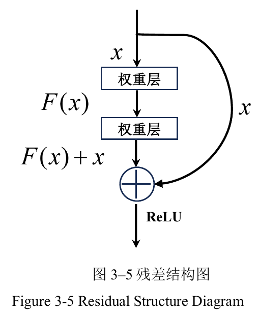

https://blog.csdn.net/weixin_36378508/article/details/133809694

# 01. LoRA和AdaLoRA区别

1. 静态秩 vs 动态秩
  LoRA：固定所有层的秩（rank r），例如统一设定 r=8。这种均等化策略忽略了不同层对下游任务的重要性差异，可能导致关键层参数不足或冗余层浪费资源。
  ​AdaLoRA：基于奇异值分解（SVD）动态调整各层秩。对关键权重矩阵（如高层Attention）分配高秩以捕捉精细特征，对次要矩阵（如低层FFN）降低秩以减少冗余参数，总参数量与LoRA保持相同但分布更合理。
2. ​参数更新范围
  LoA：仅微调Attention模块中的 W_q（Query）、W_k（Key）、W_v（Value）、W_o（Output）四类权重矩阵，FFN层通常被冻结。
  ​AdaLoRA：扩展至FFN层，通过重要性评分筛选需调整的矩阵，覆盖更全面的网络结构，提升对复杂任务的适配性。

# TODO Locon/loha，分别进⾏细节质量和速度存储空间的优化

# 02. 有哪些省内存的大语言模型训练/微调/推理方法？
有一些方法可以帮助省内存的大语言模型训练、微调和推理，以下是一些常见的方法：

参数共享（Parameter Sharing）：通过共享模型中的参数，可以减少内存占用。例如，可以在不同的位置共享相同的嵌入层或注意力机制。
梯度累积（Gradient Accumulation）：在训练过程中，将多个小批次的梯度累积起来，然后进行一次参数更新。这样可以减少每个小批次的内存需求，特别适用于GPU内存较小的情况。
梯度裁剪（Gradient Clipping）：通过限制梯度的大小，可以避免梯度爆炸的问题，从而减少内存使用。
分布式训练（Distributed Training）：将训练过程分布到多台机器或多个设备上，可以减少单个设备的内存占用。分布式训练还可以加速训练过程。
量化（Quantization）：将模型参数从高精度表示（如FP32）转换为低精度表示（如INT8或FP16），可以减少内存占用。量化方法可以通过减少参数位数或使用整数表示来实现。
剪枝（Pruning）：通过去除冗余或不重要的模型参数，可以减少模型的内存占用。剪枝方法可以根据参数的重要性进行选择，从而保持模型性能的同时减少内存需求。
蒸馏（Knowledge Distillation）：使用较小的模型（教师模型）来指导训练较大的模型（学生模型），可以从教师模型中提取知识，减少内存占用。
分块处理（Chunking）：将输入数据或模型分成较小的块进行处理，可以减少内存需求。例如，在推理过程中，可以将较长的输入序列分成多个较短的子序列进行处理。

# 03.点云OD，CenterPoint介绍

Anchor-free 检测范式，与传统的 Anchor-based 方法（如 PointPillars）不同，CenterPoint 无需预定义大量锚框，而是直接预测目标中心点，并通过中心特征回归 3D 边界框的尺寸、朝向和速度等属性。
​两阶段优化架构
- ​第一阶段：使用 3D 骨干网络（如 VoxelNet 或 PointPillars）提取点云的鸟瞰图（BEV）特征，生成热力图检测目标中心点，并回归初步的 3D 框属性。
- ​第二阶段：从一阶段预测的 3D 框中心及侧面关键点提取特征，通过轻量级 MLP 网络优化置信度得分和边界框参数，提升定位精度（如 nuScenes 数据集上 mAP 提升 2%）
https://zhuanlan.zhihu.com/p/524608535

## 04.ResNet
ResNet相较于传统的深度神经网络,引入了跳跃连接，从而使网络能够学习残差映射。这一设计有效缓解了深度 神 经 网 络 训 练 过 程 中 常 见 的 梯 度 消 失 （Gradient Vanishing） 和 梯 度 爆 炸（Gradient Explosion）问题;
避免了随着网络深度增加而导致的训练效果下降现象。

----------
# 18. PyTorch 节省显存的常用策略

- 混合精度训练
- 大 batch 训练或者称为梯度累加：具体实现是在 loss = loss / cumulative_iters
- gradient checkpointing 梯度检查点

# 08. 微调阶段样本量规模增大导致的OOM错误

全参数微调的显存需求取决于多个因素，包括模型的大小（参数数量），批次大小，序列长度，以及是否使用了混合精度训练等。对于GPT-3这样的大模型，如果想要在单个GPU上进行全参数微调，可能需要数十GB甚至上百GB的显存。

当样本量规模增大时，可能会出现OOM（Out of Memory）错误，这是因为模型需要更多的内存来存储和处理数据。为了解决这个问题，可以尝试以下方法：

- 减小批量大小：这可以减少每次训练需要处理的数据量，从而减少内存使用。
- 使用梯度累积：这种方法可以在不减小批量大小的情况下，减少内存使用。#Gradient Accumulation: 将原本一次性处理的 ​大批量数据 拆分为多个 ​小批量​（如将批量大小从64拆分为4个16），每个小批量独立完成前向传播和梯度计算，但不立即更新参数。经过指定步数（如4步）后，对累积的梯度求平均并执行一次参数更新.
- 使用模型并行：这种方法可以将模型的不同部分放在不同的设备上进行训练，从而减少每个设备需要的内存。

