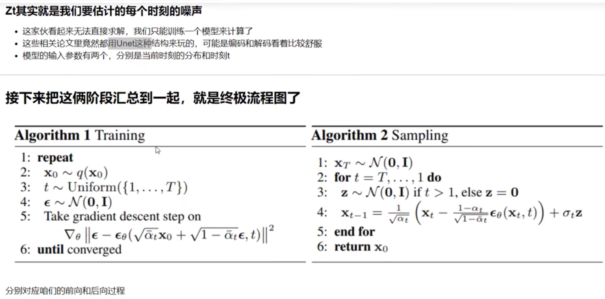
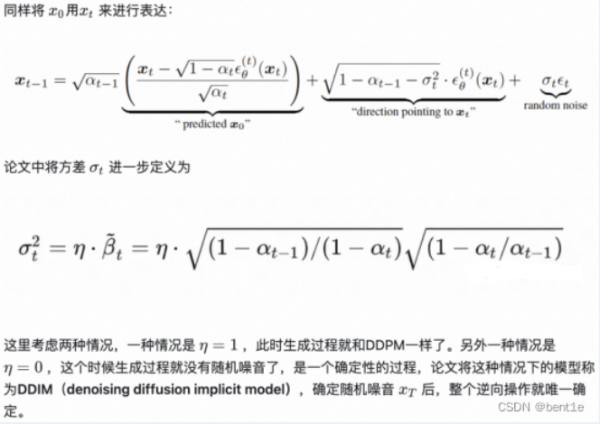
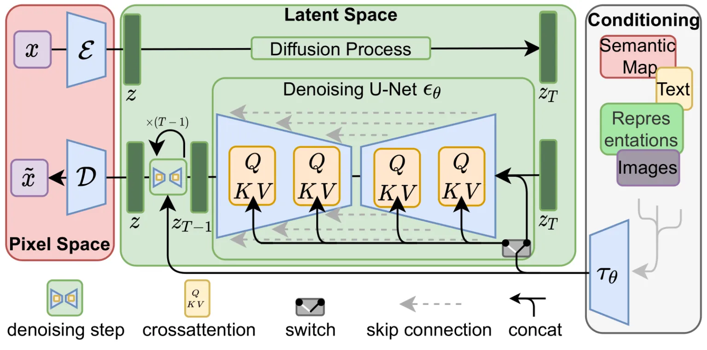
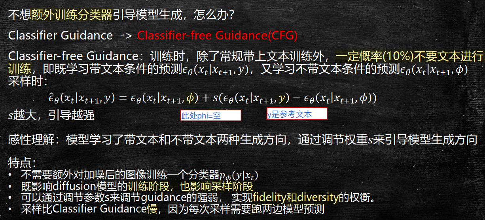
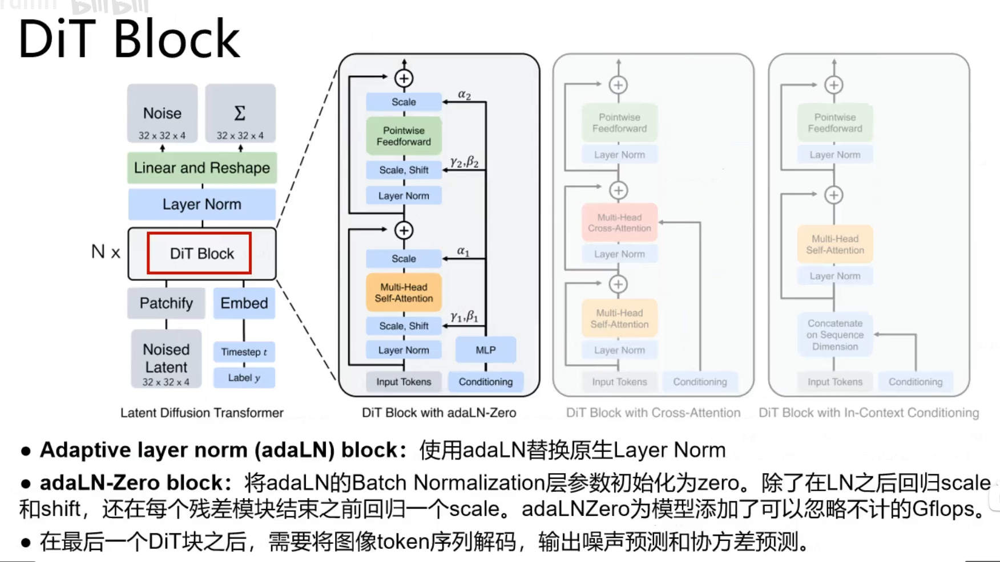
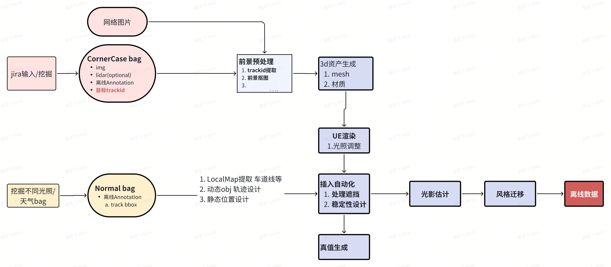

# 原理
## 01. DDPM算法原理部分：

1. 简述DDPM的算法流程：
初始化：从带噪声的图像开始。
正向扩散：逐步向数据添加高斯噪声，直到数据完全转化为无结构的噪声。
反向去噪：通过模型预测并逐渐去掉每一步加入的噪声，还原得到无噪声的图像。
训练：使用反向传播算法更新模型参数，以最小化正向和反向过程之间的差异。
测试：对新的高噪声图像应用训练好的模型进行去噪。

2. 实现DDPM是否需要什么条件：
马尔可夫链：DDPM使用马尔可夫链来描述数据的扩散过程。马尔可夫链是一个随机过程，具有无记忆性，即在给定当前状态的情况下，未来的状态只依赖于当前状态。
微小变化：DDPM通过逐步添加微小的高斯噪声来扩散数据。这些微小的变化是在数据中引入随机性的关键步骤。
高斯噪声变化：DDPM使用高斯噪声来模拟数据的扩散过程。高斯噪声是一种常见的随机噪声，也称为正态分布噪声。

3. 为什么DDPM加噪声的幅度是不⼀致的？
前期加噪少是为了保持数据结构的完整性，后期加噪多是为了加速扩散过程，使得模型能够更快地从噪声中恢复出清晰的数据。

4. DDPM预测噪声还是预测当前分布？
预测噪声，预测分布只是中间过程

## 02. DDIM算法原理部分： 

1. DDIM是怎么实现加速采样的？
DDIM通过保证DDPM的三项前向条件不变：前向⾼斯噪声+⻢尔可夫链
非马尔可夫跳步采样：允许时间步大幅跳跃，从 直接跳到 。采样过程减少计算量。

2. DDIM是不是确定性⽣成？
是确定性⽣成。因为在逆向去噪声过程中，DDIM的逆推公式，将随机噪声的部分置为0
多样性牺牲：确定性路径限制了输出的多样性。

## 03. 其他

1. IDDPM通过噪声调度优化、混合损失函数和可学习方差三大改进，显著提升了DDPM的生成质量与效率。

3. Score-Based-diffusion-model
提供了⼀种解释扩散模型的等价⽅式，其中降噪过程可以看作是沿着分数（梯度）前进

4. ⾼阶采样⽅案DPM++等加速采样⽅案
通过ODE对扩散模型进⾏建模，通过解析解的形式解构扩散模型求解步骤

## 02. 介绍一下stable diffusion的原理

Stable Diffusion 总共包含三个主要的组件，其中每个组件都拥有一个独立的神经网络：

1）Clip Text 用于文本编码。
输入：文本
输出：77 个 token 嵌入向量，其中每个向量包含 768 个维度

2）Diffusion Model： UNet + Scheduler 在信息（潜）空间中逐步处理 / 扩散信息。【Noise Scheduler定义了⼀个⾼斯分布，其均值和⽅差随着时间步的变化⽽变化，以控制噪声的添加量】
输入：文本嵌入和一个由噪声组成的初始多维数组（结构化的数字列表，也叫张量 tensor）。
输出：一个经过处理的信息阵列

3）VAE，负责图像在潜在空间的压缩与重建，压缩后的图像能让模型学得更快更好。
输入：处理过的信息矩阵，维度为（4, 64, 64）
输出：结果图像，各维度为（3，512，512）

更详细请查阅[從頭開始學習Stable Diffusion](https://chrislee0728.medium.com/%E5%BE%9E%E9%A0%AD%E9%96%8B%E5%A7%8B%E5%AD%B8%E7%BF%92stable-diffusion-%E4%B8%80%E5%80%8B%E5%88%9D%E5%AD%B8%E8%80%85%E6%8C%87%E5%8D%97-ec34d7726a6c)【介绍了dreambooth Lora controlNet】

更详细请查阅[十分钟理解Stable Diffusion](https://www.ithome.com/0/668/981.htm)

## 3. 为什么原⽣SD的控制效果不太好，需要引⼊如ControlNet的控制模型 

因为控制是⼀个隐性控制模型，通过CrossAttention的权重隐性引导⽣成结果，并不是完全控制

## 20. Stable Diffusion里是如何用文本来控制生成的？

Stable Diffusion是一种潜在扩散模型，主要通过自动编码器（VAE），U-Net以及文本编码器三个核心组件完成用文本来控制生成的图像。**Unet的Attention模块Latent Feature和Context Embedding作为输入，将两者进行Cross Attenetion操作**，将图像信息和文本信息进行了融合，整体上是一个经典的Transformer流程。

## 21. Stable Diffusion相比Diffusion主要解决的问题是什么？

Diffusion的缺点是在反向扩散过程中需要把完整尺寸的图片输入到U-Net，这使得当图片尺寸以及time step t足够大时，Diffusion会非常的慢。

## 22. Diffusion每一轮训练样本选择一个随机时间步长？

1. ​提升模型泛化能力，​防止过拟合。随机时间步迫使模型 ​同时学习所有噪声水平 的去噪策略，避免仅擅长处理特定阶段的噪声（如仅能处理中等噪声水平），从而在生成时能稳定地从纯噪声逐步还原数据。随机化打破了时间步的顺序相关性，避免模型记忆特定噪声模式，增强对 ​未见数据 的适应能力
2. ​平衡计算效率与效果。若固定时间步（如按顺序训练 t=1,2,...,T），需要 T 倍计算资源，而随机采样使每个批次均匀覆盖所有 t，显著减少训练时间；
实验表明，随机化策略可使模型在约**10万次**迭代后收敛，而固定顺序训练需要数百万次迭代。

----
训练过程包含：每一个训练样本选择一个随机时间步长，将time step 对应的高斯噪声应用到图片中，将time step转化为对应embedding；

模型在训练过程中 loss 会逐渐降低，越到后面 loss 的变化幅度越小。如果时间步长是递增的，那么必然会使得模型过多的关注较早的时间步长（因为早期 loss 大），而忽略了较晚的时间步长信息。

## 24. 介绍⼀下SD，Dall-E2两者的异同

Dalle2通过自回归的方式逐个预测像素点，最终生成符合描述的图像。
SD加⼊了Latent-Space（⼤幅降低特征维度），以及交叉注意⼒机制+Unet的步骤，更精细更可控

## 25. 介绍下classifier-free guidance和Classifier Guidance

CFG训练时,除了常规带上文本训练外,一定概率s(10%)不要文本进行训练

## 27. Stable Diffusion XL是一个二阶段的级联扩散模型，简述其工作流？

核⼼优化：
接⼊级联的refiner模型+微调⽹络结构，⼤幅度提升⽣成质量。
多样化的训练策略，⼤幅提升基础模型表达能⼒

训练策略：
图像尺⼨条件化：把图像的尺⼨编码后作为信息输⼊到模型中。
裁剪参数化训练：裁剪坐标也和尺⼨⼀样送⼊模型中。
多尺度训练：多尺度+分桶
噪声偏置：针对冷⻔⾊域，加⼊初始化噪声偏置

https://zhuanlan.zhihu.com/p/643420260

## 50. DiT和Stable Diffusion的Unet条件引入方式有什么不同？例如文本条件生成图像？

和ViT类似，但还需要输入condition，有3种方式处理，最终采用AdaLN-Zero方式
1. DiT（如 PixArt-Sigma、SD3）​【纯Transformer，并行性好，可大规模扩展】
   1. adaLN-Zero 自适应层归一化： 文本条件和时间步通过 ​独立嵌入网络​（如 T5 编码器）编码为向量，输入每个 DiT 块的 adaLN-Zero 层，生成 ​动态缩放因子（Scale）和平移因子（Shift）​，直接调整归一化后的特征分布
   2. In-context conditioning：把条件信息 t 和 c 作为额外的token拼接到DiT的input token中
   3. Cross-attention block：将 t 和 c 的 embeddings 拼接起来，然后再插入一个cross attention，条件embeddings作为cross attention的key和value；这种方式需要额外引入15%的Gflops。

2. Unet 【卷积+跳跃连接，模型深度和宽度受限】
   1. ​交叉注意力（Cross Attention）为主, **将文本嵌入作为 ​Key-Value 对，图像latent空间特征作为 ​Query**
   2. ​时间嵌入（Time Embedding）辅助

## 51. hunyuan-DiT的优势

| 对比维度       | Hunyuan-DiT                                                                 | 标准 DiT                                                                 | 技术来源        |
|--------------------|---------------------------------------------------------------------------------|-----------------------------------------------------------------------------|---------------------|
| 架构设计       | 1. 结合双语 CLIP + 多语言 T5 编码器 2. 引入类似 U-Net 的编码器-解码器跨层连接，保留细节 | 单一文本编码器（如 BERT），直筒型纯 Transformer 结构                    |            |
| 条件注入机制   | 1. 在交叉注意力层直接注入文本编码（细粒度控制） 2. 支持多轮对话条件迭代修改生成结果          | 依赖 adaLN-Zero 动态参数调整（全局粗粒度控制）                            |            |
| 位置编码       | 采用二维 RoPE（Centralized Interpolative PE），适配多分辨率生成              | 标准一维位置编码，难以泛化不同分辨率                                      |                |
| 语言支持       | 1. 原生中文理解（古诗词、地域文化元素） 2. 支持 256 字符长提示词                          | 主要面向英文，中文生成易出现语义偏差                                      |                |
| 训练优化       | 1. 数据护航机制（金/银/铜级分层筛选） 2. 引入 QK-Norm 和 FP32 混合精度防梯度爆炸           | 依赖未分层的开源数据集（如 LAION-5B），训练稳定性技术较少             |                |
| 部署效率       | 最低 5GB 显存即可运行（FlashVDM 加速技术），支持消费级显卡                      | 通常需 16GB 以上显存（如 SD3 的 8B 参数模型）                             |            |
| 应用扩展性     | 1. 支持文生图、3D 生成（Hunyuan3D-DiT-v2-0） 2. 多模态视频生成基础架构                   | 主要聚焦文生图，跨模态扩展需重新设计（如 Sora 独立架构）                  |            |

---

## 52. DDPM、Flow Matching（FM）和Rectified Flow（RF）三者的核心区别分析

1. DDPM（去噪扩散概率模型）  
   • 基于扩散过程的马尔可夫链建模，通过逐步加噪（前向过程）和去噪（反向过程）实现生成。
   • 核心目标函数为噪声预测：  
     \[
     \mathcal{L}_{\text{DDPM}} = \mathbb{E}_{t,\epsilon} \left\| \epsilon_\theta(x_t, t) - \epsilon \right\|^2
     \]
     其中 \( \epsilon \) 是高斯噪声，\( \epsilon_\theta \) 是神经网络预测的噪声。

2. Flow Matching（FM）  
   • 通过常微分方程（ODE）框架直接建模数据分布与噪声分布之间的映射，目标是最小化向量场回归损失（条件流匹配，CFM）：  
     \[
     \mathcal{L}_{\text{FM}} = \mathbb{E}_{t,x} \left\| v_\theta(x_t, t) - u_t(x) \right\|^2
     \]
     其中 \( u_t(x) \) 是目标速度场，通过最优传输思想构造直线概率路径。

3. Rectified Flow（RF）  
   • 在FM基础上引入**速度场恒定约束**（\( \frac{dv_t}{dt} = 0 \)），强制轨迹直线化，并通过迭代优化（如RF-2、RF-3）进一步拉直路径。  
   • 数学形式更简洁，前向过程定义为数据与噪声的直线插值：  
     \[
     x_t = (1-t)x_0 + t\epsilon, \quad \epsilon \sim \mathcal{N}(0, I)
     \]

# 可控视频生成

1. MagicDrive研发进展
  1. •条件控制：
    ￮天气：调用gpt进行识别 
    ￮动态：复用论文中的处理方式
    ￮静态：结合lms框架拓展类别，如虚线、实线等
  2. •数据预处理，22W帧训练数据？
    图像resize=2，1024x768->512x384
    ￮去畸变但不做虚拟相机：实验上效果更好，黑边小
    ￮resize：加快训练读取速度
    ￮保存在sensor_data/camera_undistort_resize

  3. 已完成：
    a.根据map object layout+文字prompt，生成不同相机下的单帧图片
    b.可控制天气、光照、场景、object位置

  4. TODO:
    a.可输入参考帧
    b.时序一致性约束，生成视频
    c.拓展到城市，引入其他控制标签，如红绿灯、限速牌（2d/3d）

2. MagicDriveDit模型侧：
    Diffusion：Unet --> multiView-DiT
    采样方式：DDPM --> Flow match

3. MagicDriveDit研发进展
  •条件控制&数据预处理复用MagicDrive
  - 多阶段训练：
    1. Stage1：可控图像生成，小分辨率  tfs
    2. Stage2：可控视频生成，可变分辨率
    3. Stage3：更高分辨率，更多帧数视频
  - 工作内容：
    1. nuscenes效果复现
    2. 自研数据适配：trackid引入，静态控制条件修改（from magicdrive）
  - 目前问题：
    - 第一阶段分辨率设置有问题，变大后nan
    - 第二阶段训练速度太慢，待优化
  - nan问题排查：图像生成&视频生成均会nan
    - 异常批次跳过、梯度scale、降学习率2e-5以下

1. 3090帧率：12s/frame

5. 存在问题
   1. 伪标签会给出lidar可见但视觉不可见的车，对训练影响可能比较大
   2. 红绿灯、限速牌等细节控制能力待研究
   3. 多模态渲染较弱

# 插入2d视频流

1. 生成资产问题
   1. hunyuan 生成的模型一般尺寸 scale+角度不统一，需确定scale+统一坐标系；
2. 重建资产
   1. 3drealcar
   2. streetgs重建

3. 相机调参，blender
   1. 调整物体的材质：金属度、粗糙度、粗糙度、法线贴图等，产生真实感
   2. 
4. 遮挡问题
   1. 通过伪标签判断前景还是背景；有很多cornercase
5. 位置稳定性
   1. 光流跟踪
6. 光影一致性
   1. 给一个地面，使得插入物体产生阴影
   2. 训练模型学习HDR
   3. 使用HDR贴图

7. 风格迁移
   1. StyleShot，前后帧不一致；只有单cam

# 生成式辅助重建
https://lotuscars.feishu.cn/docx/QAOQdlFGNoZOlYxNGncccD0znpe
1. ReconDreamer：DriveRestorer训练方式
   1. 数据集：训练不充分的重建模型，沿原始轨迹渲染视频，由于模型欠拟合，自然会产生重影伪影，用gt图片监督
   2. 基于构建的数据集，我们训练 DriveRestorer 来恢复渲染视频中的伪影。
   3. 将训练好的模型，冻结其参数以恢复新的轨迹渲染图
2. 方案问题：视角变化，worldmodel生成的场景，一致性如何？

# 评测方式
1. FID计算公式（越小越好）

  FID（Fréchet Inception Distance）是一种用于评估生成模型质量的度量标准，特别是常用于评估生成对抗网络（GANs）的性能。它通过比较真实图像集和生成图像集之间的相似性来衡量生成模型的好坏。
  FID值越低，表示生成的图像与真实的图像越接近。
  note：该指标是分类任务的score，不同类别分别有FID指标；对于AD场景级别的评价，理论上并不合适；小鹏Anything，FID指标不能反映实际问题。

  - 提取特征向量：首先使用预训练的Inception V3模型（通常是在ImageNet上训练的）提取真实图像和生成图像的特征向量。这个模型的输出层之前的某一层（通常是pool_3层）被用作特征提取器，因为这一层的输出包含了丰富的图像信息
  - 计算均值和协方差矩阵：对于从真实图像和生成图像中提取的所有特征向量
  - 计算FID分数
  \[
  FID = \| \mu_r - \mu_g \|^2 + Tr(\Sigma_r + \Sigma_g - 2(\Sigma_r \Sigma_g)^{1/2})
  \]

   FID反映了图像质量，而FVD是一个时间感知指标，它同时反映了图像质量和时间一致性。
   
2. 感知任务评测
   1. 当前只针对重建视频的评测，NVS、生成图像评测未开展。
   2. 车道线：原始bag检测结果作为真值，重建bag检测见过。
      1. sim2real gap 只差一个点，重建质量对感知影响不大
   3. 障碍物：是否替换actor？
      1. 不替换。评价方法和车道线类似
      2. 替换，没有参考意义。
   4. nvs因为遮挡，真值不好搞
3. 间接感知评测
   1. 感知模型在real数据上训练，在real数据集上评测  
   2. 感知模型在real+sim数据上训练，在real数据集上评测  
